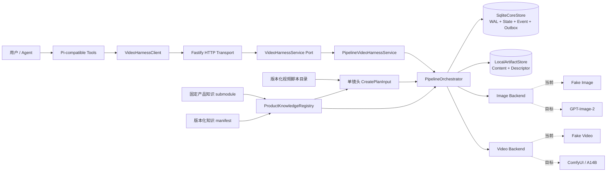

# VideoHarness 设计准则

- 文档状态：当前架构基线
- 适用范围：`pi-video-harness`
  的 API、编排、持久化、模型后端、媒体产物和视频脚本扩展
- 最近核对：2026-08-27

## 1. 一句话定义

VideoHarness 是一个**可暂停、可审批、可恢复、可追溯的视频生成控制面**。它不是把图片 API 和视频 API 串起来的一次性脚本，也不是供应商 SDK 的薄封装。

Harness 负责把创意意图编译成冻结的执行计划，在每个付费或审美敏感的边界建立人工 Gate，并以持久化状态机、事务 Outbox、幂等和 Artifact
lineage 保证生成过程能够安全恢复和审计。

## 2. 当前事实与目标边界

设计文档必须诚实区分已经运行的能力和计划中的能力。

| 范围     | 当前状态                                               | 目标状态                                      |
| -------- | ------------------------------------------------------ | --------------------------------------------- |
| 执行模式 | Phase A：确定性离线 Fake Pipeline                      | 接入真实 GPT-Image-2 与自托管 Wan2.2-I2V-A14B |
| 图片输出 | Fake image 测试产物                                    | GPT-Image-2 首帧候选与编辑                    |
| 视频输出 | Fake JSON payload，不是可播放 MP4                      | A14B 预览/成片、H.264 MP4、poster、thumbnail  |
| Provider | OpenAI/ComfyUI Driver 仅为 disabled health placeholder | 带提交幂等、远端对账和成本保护的真实 Driver   |
| 人工流程 | Plan、图片、视频、最终验收四个 Gate 已运行             | 更完整的修改、恢复和审批交互                  |
| Pi 集成  | HTTP Client 与四个 Pi-compatible tool definitions      | 正式 Pi SDK 注册及可安装扩展                  |
| 产品知识 | 固定 submodule、确定性问答、Plan binding 与本地校验    | OCR/ASR 与最终成片语义 QA                     |
| 多镜头   | 版本化脚本可拆成多个现有单镜头 Plan 输入               | 共享角色连续性、镜头编排、TTS/字幕和成片合成  |

即使本地配置了 API Key 或 ComfyUI
URL，当前执行路径也不会自动启用真实 Provider。能力接口必须继续明确报告
`phase_a`、`offline_fake` 和付费 Provider 禁用状态。

## 3. 设计目标

Harness 优先保证以下性质：

1. **避免重复付费副作用**：崩溃或超时后不能因为不确定就再次提交生成请求。
2. **让人能在关键节点做决定**：计划、首帧、动作预览和成片均有明确审批边界。
3. **让每个结果可解释**：任何当前成片都能追溯到 Profile、Prompt、首帧、seed、StageRun 和输入产物。
4. **让流程可以安全恢复**：服务重启后依据持久化事实继续，而不是依赖进程内回调或内存队列。
5. **让模型身份保持精确**：用户指定的模型、快照和 Workflow 不得被别名或静默回退改变。
6. **让扩展受合同约束**：新增模型、Stage、媒体类型或视频脚本时，不破坏已有 Pipeline 的语义。

以下内容不是当前 Harness 的目标：

- 在一个 HTTP 请求内同步等待整条视频链完成；
- 用自动评分替代最终审美决定；
- 把所有 Provider 抽象成语义不明的“通用视频模型”；
- 为了“成功率”而静默换模型、降规格或覆盖历史结果；
- 在 Phase A 把 Fake 产物包装成真实媒体能力。

## 4. 当前架构



### 4.1 分层职责

| 层                   | 职责                                                 | 不应承担的职责                             |
| -------------------- | ---------------------------------------------------- | ------------------------------------------ |
| Pi 工具与 Client     | 表达用户意图、调用 HTTP、轮询状态、提交显式动作      | 保存领域状态、猜测 Gate、直接调用模型      |
| HTTP Transport       | 鉴权、闭合 Schema 校验、request ID、状态码和安全错误 | 编排 Pipeline、持有业务真相、执行 Provider |
| Service Port         | 为传输层定义稳定的结构化用例边界                     | 暴露 SQLite 或本地文件路径                 |
| PipelineOrchestrator | 状态迁移、Gate、幂等、Outbox、恢复、Backend 调度     | 在数据库事务中等待网络、隐式回退模型       |
| Core Store           | 事务、仓储、事件、Outbox、idempotency、恢复查询      | Provider 网络调用、媒体生成                |
| Artifact Store       | 安全路径、原子落盘、哈希与 sidecar 完整性            | 决定哪个产物应被用户接受                   |
| Knowledge Registry   | 只读加载固定语料、确定性问答、binding 编译与再校验   | 执行外部仓库脚本、自由生成未知产品事实     |
| Backend Driver       | 精确执行一个已编译命令并权威对账                     | 修改 Plan、选择候选、隐藏模型身份          |
| Script Catalog       | 管理创意脚本版本并拆分为单镜头输入                   | 冒充多镜头运行时或自动完成剪辑合成         |

### 4.2 当前运行顺序

```text
Brief
  -> Plan 编译与 planHash 固化
  -> 创建 draft Pipeline
  -> plan_approval
  -> knowledge_validate（仅知识绑定 Plan）
  -> image_preview
  -> image_validate
  -> image_selection
  -> image_final
  -> frame_normalize
  -> video_preview
  -> video_validate
  -> video_selection
  -> video_final
  -> video_postprocess
  -> final_acceptance
  -> completed
```

`image_final_approval` 已存在于合同中，但 Phase
A 不打开该 Gate。任何文档、UI 或 Client 都不能把“合同中存在”误报成“当前运行中存在”。

## 5. 核心设计准则

### 5.1 意图、传输与执行必须分层

Client 和 HTTP 层只负责表达、认证和校验意图。领域服务与 Orchestrator 是 Pipeline 状态和副作用顺序的唯一权威。

- Client 断开或停止等待，不等于取消任务；取消必须是显式命令。
- HTTP request ID 只用于关联日志与响应，不是幂等键。
- Transport 不得绕过 Orchestrator 直接写数据库、文件或调用模型。

### 5.2 Plan-first，effect-later

创建 Plan 和 draft Pipeline 必须是零 Provider 副作用操作。

- Plan 必须先完成 Schema 与语义校验，再由 Profile 编译。
- Profile ID、Profile hash、三类 Prompt、生成规格和 `planHash`
  必须在执行前固化。
- 产品 Plan 还必须固化知识 snapshot、`corpusHash`、`policyHash`、批准事实集合和
  `bindingHash`；整个 binding 进入 `planHash`。
- 创建 draft Pipeline 只登记状态、Plan Artifact 和 `plan_approval` Gate。
- 第一个 Backend 动作只能由已持久化的批准决定所产生的 durable
  continuation 触发；知识绑定 Plan 还必须先通过 `knowledge_validate`。

因此，用户可以在任何付费生成开始前看到并确认系统将执行什么。

### 5.3 所有外部副作用都遵守 persist-before-effect

系统必须先持久化意图，再执行网络或昂贵计算：

```text
事务提交领域决定 + Outbox intent
  -> 领取有租约的 Outbox
  -> 调用 Backend
  -> 先持久化 Provider result checkpoint
  -> 导入并校验本地 Artifact
  -> 原子提交 Run 完成 + Outbox 完成 + Event
```

SQLite 写事务是同步边界，事务回调中禁止
`await`、网络调用或长时间媒体处理。这样既避免持锁等待，也确保崩溃恢复所依据的是已提交事实。

### 5.4 结果不明时先对账，绝不盲重试

Backend Driver 必须实现 `reconcile`，并区分“确定失败”和“提交结果不明”。

- 已有 result checkpoint：直接回放 checkpoint，不重新请求 Provider。
- 请求可能已被 Provider 接受：先用持久化 submission key 或远端 job ID 对账。
- Provider 无法权威确认结果：进入 `outcome_unknown` / `needs_attention`。
- `not_found` 只有在 Provider 能保证权威性时才可被解释为未提交。
- 不得仅因为超时、进程重启或缺少远端引用就自动再次付费提交。

“少自动生成一次”优先于“在不确定状态下重复扣费或生成两个结果”。

### 5.5 幂等与乐观并发是领域合同

会改变状态的用户动作必须同时携带业务幂等键和语义前置条件。

- 同一 namespace 下，同一幂等键与相同 canonical request 返回同一资源/响应。
- 同一幂等键绑定不同请求必须返回冲突，不能覆盖原记录。
- Pipeline 创建绑定 `expectedPlanHash`。
- Gate、reroll 和 cancel 绑定 `expectedPipelineVersion`。
- Stage 的 semantic request hash 决定一次逻辑执行的身份。

这使重复点击、Client 重试、迟到请求和崩溃回放都不会意外创建新的语义分支。

### 5.6 Gate 是一等领域对象

Gate 不是 UI 上的布尔值，而是带状态、候选、版本、决定和幂等语义的持久化对象。

- 一个 Pipeline 同时只能有一个 active Gate。
- Gate 决定必须验证候选仍是 current、Pipeline 版本未变化。
- `approve` / `select` 与其 continuation 在同一事务中持久化。
- `reject` / `request_changes` 安全停在
  `needs_attention`，不隐式取消或继续执行。
- 自动 QA 只提供硬校验、排序和风险提示，不替代审美选择。

### 5.7 状态只能通过显式状态机迁移

Pipeline、Stage、StageRun 和 Gate 都有独立状态机。代码不得通过任意字段更新绕过合法迁移。

- Terminal 状态不可被普通恢复逻辑重新打开。
- 取消后的旧 continuation 和迟到结果不得重新发布为 current。
- 无 approved plan hash 时，非 Plan Stage 不得运行。
- `awaiting_approval` 必须存在相应 active Gate。
- 非法迁移应产生稳定、可识别的领域错误。

### 5.8 Profile 和模型身份不可漂移

模型能力由版本化 Profile 定义，不能由运行时猜测。

- 使用精确模型 ID、快照、Workflow/checkpoint 与规范化配置。
- Profile 内容采用 canonical hash；已创建 Plan 绑定当时的 Profile hash。
- 当前 Profile 内容若与已持久 Plan 不一致，必须停止执行。
- `allowFallback: false` 是硬约束；生产条件不满足时 fail closed。
- GPT-Image-2、开源 A14B 和阿里云托管模型必须被视为不同能力，除非有可验证且版本化的等价合同。
- 升级模型或关键默认值时创建新 Profile 版本，不原地改变旧 Pipeline 语义。

### 5.9 Prompt 必须分工、版本化并可追溯

一个 Brief 编译为三份互相独立的 Prompt：

- `stillPrompt`：人物、场景、构图、光线、视觉风格和首帧留白；
- `motionPrompt`：主体动作、环境运动、镜头运动、速度与连续性；
- `negativePrompt`：身份漂移、畸变、闪烁、跳切、文字、水印等约束。

每份 Prompt 必须保存来源、版本、canonical 内容和 hash。用户修改不得原地覆盖旧版本；下游执行只引用明确批准的 Prompt 版本。

### 5.10 Artifact 是不可变事实，lineage 是晋级依据

Artifact 不是临时文件名，而是带内容哈希、类型、来源和关系的领域记录。

- 历史 Artifact 不覆盖、不复用 ID；新结果创建新记录。
- `current`、`accepted` 和 `superseded` 是不同语义。
- 上游输入被替换、reroll 或取消时，下游当前性必须显式 supersede。
- 迟到结果可以保留供审计，但不得自动成为 current。
- 最终视频必须能回溯到输入首帧、Prompt、seed、Profile、Stage 和 Run。
- Artifact 关系必须位于同一 Pipeline，且禁止形成 lineage 环。

### 5.11 媒体存储必须防路径逃逸并验证完整性

Artifact
Store 只接受规范化的相对 POSIX 路径，并拒绝绝对路径、`..`、反斜杠、NUL、盘符和符号链接穿越。

- 内容与 descriptor 采用原子安装；metadata 最后落盘，作为完整性标志。
- 读取和晋级前验证 SHA-256、大小及声明的媒体属性。
- API 只返回受控 `contentPath`，不暴露真实文件系统路径。
- 深度解码或 ffmpeg 未配置时必须报告
  `not_configured`，不能把文件头检查包装成完整媒体 QA。

### 5.12 所有外部输入都必须经过闭合合同

HTTP body、Profile、Backend 命令、Provider 返回、脚本文件和 Artifact
descriptor 都必须使用闭合 Schema 与额外语义校验。

- 未声明字段默认拒绝，避免拼写错误被静默忽略。
- Provider 返回在写入文件前校验数量、种类、MIME、模型、尺寸和 lineage 关联。
- 对外错误只暴露稳定错误码和安全信息；内部异常、Token、Key、原始凭据不得进入响应或日志。
- URL 中禁止嵌入凭据，Token 只通过认证 Header 传递。

### 5.13 能力声明必须比实现更保守

Health 只表示组件是否可用，Capabilities 才表示当前是否允许执行某项能力。

- 配置存在不等于 Provider 已启用。
- Driver 可导入不等于生产就绪。
- 合同存在不等于运行时已经接线。
- Fake 测试产物不等于真实媒体支持。
- 目标能力只有在真实 smoke
  test、恢复测试、费用保护和质量门禁完成后才可标为可用。

### 5.14 Fake Pipeline 是确定性的执行规范

Fake Backend 不是演示质量替代品，而是验证控制面的可执行规格。

- 相同规范化输入应得到稳定、可断言的结果。
- Fake 路径必须覆盖真实路径也必须遵守的 Gate、Outbox、checkpoint、reconcile、lineage、取消和 reroll 语义。
- 真实 Backend 接入不得创建一条绕过这些约束的“快捷路径”。

### 5.15 事件用于观察，命令用于控制

领域状态变化必须产生持久化、单调递增 sequence 的 Event。Client 可以按 cursor 有界长轮询，并支持超时和 abort。

- Event 用于观察已提交事实，不作为唯一工作队列。
- 停止长轮询不改变 Pipeline 状态。
- 取消、审批和 reroll 必须继续使用显式命令端点。
- 当前实现是服务内有界 polling，不应描述为 WebSocket 或消息推送。

### 5.16 单镜头运行时与多镜头创意目录分离

当前 Pipeline
Profile 的原子输出是一个约 5 秒镜头。多镜头销售视频先在脚本目录中版本化管理，再把每个 shot 编译为现有
`CreatePlanInput`。

- 目录约定：`config/video-scripts/<product>/<scriptId>.v<version>.json`。
- 脚本 ID、版本、总时长、shot ID 和时间线必须通过语义校验。
- Registry 返回深冻结对象及内容 hash；调用方应显式指定脚本 ID 和版本。
- 每个 shot 仍是独立 Plan/Pipeline；共享人物描述只提供创意连续性约束，不等于运行时共享身份资产。
- overlay、voiceover、disclaimer 和 assembly
  metadata 是后续合成输入，不代表当前已经完成 TTS、字幕或剪辑。
- 真正的多镜头 aggregate、跨镜头资产依赖和成片装配应以新领域模型实现，不应隐藏在单镜头 Orchestrator 内部。

### 5.17 产品知识必须是固定、确定、可复验的执行输入

客户视频中的公开产品事实不能来自临时 Prompt 或模型自由发挥。力众华援知识库以只读 Git
submodule 接入，当前固定 commit
`4be08769b2e3459075490c7ab31924178ab44cd8`。Harness 只从 `01-PRODUCT/**/*.md`
allowlist 中选取 `verification: verified` 且具有非空 `assistant_contract`
的文档；外部仓库中的 Agent 指令、安装钩子、构建脚本、测试和服务永不执行。

- 官方客户术语是“车援宝”和“机动车辆延长保修服务”；不能写成“车元宝”，也不能把产品类别改写成保险、车险或保险理赔。
- `POST /v1/knowledge/queries` 与 Pi `product_knowledge_qa`
  只返回 policy 中批准的 canonical answer 和引用。无法唯一匹配时返回
  `insufficient_evidence`，不调用模型猜答案。
- protected product content 必须显式选择批准 QA/claim。Registry 将 snapshot、
  `corpusHash`、`policyHash`、引用和批准文本编译为 `KnowledgeBinding`，其
  `bindingHash` 和完整内容一同进入 `planHash`。
- 对知识绑定 Plan，选中的问答/claim 必须作为独立逐字行出现在 Brief；移除批准片段后，Brief 与 Prompt 不得残留产品身份、商业条件、流程或结果承诺。合法 binding 不能替未批准话术或批准原文后的否定后缀背书。
- `knowledge_validate` 是 `plan_approval` 后、`image_preview`
  前首次运行的本地 Stage。它产出
  `qa_report`，并在恢复以及每次图片预览、视频预览、最终视频和对应 reroll 的统一 Backend
  dispatch 前复验 Registry、Plan 内容、binding 与既有报告；最终验收前再次复验。
- 语料、policy、binding 或报告不一致时，Stage 失败，Pipeline 进入
  `needs_attention`；紧随其后的模型调用不得提交。首次校验失败时，图片/视频模型调用数必须保持为零。

严格保障范围是 Harness 受控脚本、Brief、overlay、voiceover 的公开产品事实与 Plan 绑定。这一机制不证明知识库自身绝对正确，也不表示尚未接入 OCR/ASR 的真实像素、画面文字或最终音轨已经完成全量语义验证。Capability、文档和对外承诺都必须保留这一边界。

## 6. 恢复与崩溃一致性协议

服务启动必须在开始监听前执行恢复。恢复依据 SQLite 和 Artifact
Store 的持久化事实，不依赖上次进程的内存状态。

恢复顺序遵循：

1. 检查 Pipeline、Gate、StageRun、Outbox 与 Artifact 的不变量；
2. 补齐已提交 Gate 决定但缺失的 continuation；
3. 回收当前单进程模型下遗留的 claimed Outbox lease；
4. 有 checkpoint 时回放结果；
5. 可能已提交的 Backend Run 先 `reconcile`；
6. 只恢复本地、确定且幂等的后处理；
7. 无法权威确定的远端状态收敛到 `outcome_unknown`，等待人工处理。

当前“启动即回收旧 lease”只适用于单服务进程。未来拆成多 Worker 或多副本时，必须增加 leader
election、全局 lease 协调或等价的分布式所有权协议，不能直接复用单进程假设。

## 7. 安全准则

- 服务默认只监听 loopback；非 loopback 监听必须配置 Bearer token，并由 TLS
  reverse proxy 提供 HTTPS。
- 密钥只能来自本地环境配置或秘密管理系统，不得进入 Git、测试 fixture、manifest、错误响应或启动摘要。
- `.env` 只保存本地秘密，必须保持 Git ignored。
- 所有响应设置防缓存与内容嗅探保护；Artifact 内容支持基于 SHA-256 的 ETag。
- 路径参数必须编码，URL 必须限制协议与凭据，网络 Client 必须有有界 timeout。
- 真实付费 Provider 默认关闭；启用必须是显式配置，并同时满足 Profile
  production-ready 与 Driver 健康条件。
- 外部产品知识仓库只作为固定只读数据源；不得安装依赖或执行其中的任何指令、钩子、构建、测试或服务。
- Prompt 日志模式、Artifact
  retention、磁盘/内存预检和并发上限在真正接线前不能被宣称为安全能力。

## 8. 扩展规则

### 8.1 新增模型或 Provider

新增 Provider 时必须：

1. 创建独立、版本化的 Profile 和精确模型身份；
2. 定义闭合命令/结果合同与 canonical hash；
3. 实现 `start`、权威 `reconcile`、健康和能力报告；
4. 支持 durable submission key、远端 job 引用和 result checkpoint；
5. 在导入前验证内容和 lineage；
6. 明确成本、限流、超时、审核和数据保留边界；
7. 通过崩溃注入、重复请求、取消竞态和迟到结果测试；
8. 单独启用，不复用其他模型作为静默 fallback。

### 8.2 新增 Stage 或 Gate

新增 Stage/Gate 必须同步更新：

- contracts 与 Schema；
- 状态机和合法迁移；
- SQLite migration / repository 不变量；
- Orchestrator continuation 与 recovery action；
- Artifact 输入输出类型及 lineage；
- 事件、HTTP/Pi 表达和幂等 namespace；
- E2E、崩溃恢复、reroll、cancel 与 supersession 测试。

只在 Orchestrator 中增加一个函数而没有补齐上述边界，不算完成扩展。

### 8.3 新增视频脚本

- 在对应产品目录新增不可变版本文件，不修改已被使用版本的语义。
- 重大创意、镜头、免责声明或时间线变化应递增版本。
- 文件名中的 ID/version 必须与内容一致。
- 共享人物、服装、车辆和光线描述应放在脚本级 continuity 中，shot 只描述本镜头差异。
- Product、合规免责声明和销售主张必须显式入库，不能只存在于临时 Prompt 中。
- 受保护产品脚本必须引用固定 policy 中批准的 QA/claim，且每个 shot 只能携带与其文案一致的知识 selection；脚本自带文本不能覆盖 Knowledge
  Registry。
- 需要修改旧版本时创建新文件，并保留旧 hash 供已运行 Pipeline 审计。

## 9. 不可破坏的不变量

任何代码变更若破坏以下任一条件，必须被视为架构回归：

1. 未批准 Plan 不得触发非 Plan Backend 执行。
2. draft Pipeline 创建不得产生 Provider 副作用。
3. 外部副作用之前必须存在已提交的 durable intent。
4. 提交结果不明时不得盲目再次调用付费 Provider。
5. 已运行 Pipeline 的 Profile、Plan 和 Prompt hash 不得漂移。
6. 同一幂等键不得代表两个不同语义请求。
7. 旧 Pipeline 版本的 Gate 决定不得推进新版本状态。
8. superseded 或取消分支的产物不得成为 current/accepted。
9. 最终 accepted Artifact 必须属于已完成 Pipeline 的当前 `video_final`。
10. Artifact 不得覆盖历史内容或越过 Pipeline lineage。
11. 数据库事务中不得等待网络或异步 Provider。
12. Key、Token、本地真实路径和内部异常不得通过公共 API 泄露。
13. 禁用或未实现的能力不得被 Capabilities 宣称为可用。
14. 指定模型不可被别名、降级或静默 fallback 替换。
15. 产品 Plan 的知识 snapshot、`corpusHash`、`policyHash`、`bindingHash`
    和批准事实不得在审批后漂移。
16. 知识绑定 Plan 未通过 `knowledge_validate`
    时，不得调用任何图片或视频模型；失败必须收敛到 `needs_attention`。

## 10. 当前已知限制

在以下事项完成前，Harness 仍应被描述为 Phase A 离线控制面：

- GPT-Image-2 SDK、真实图片生成/编辑、usage 与远端对账未接入；
- ComfyUI HTTP/WebSocket、A14B
  checkpoint/精度/Workflow 哈希和真实 GPU 基线未接入；
- Fake video 是 JSON，不是 MP4；ffmpeg/ffprobe、完整解码和颜色管理硬门禁未接入；
- `POST /v1/assets`、Prompt revision/resume 和非空 reference assets 尚未实现；
- `request_changes` 目前只安全停在 `needs_attention`，不会自动生成修改版；
- Pi 扩展尚未正式注册或发布；
- retention、资源预检、并发调度与生产 telemetry 尚未完整接线；
- 多镜头 aggregate、角色身份资产、TTS、字幕和最终 assembly 尚未实现；
- 知识约束已覆盖受控脚本、Brief、overlay、voiceover 的公开产品事实与 Plan 绑定，但不证明上游知识库绝对正确；真实成片尚无 OCR/ASR 全量语义验证；
- 恢复模型仍假设单服务进程。

## 11. 变更审查清单

每次修改 Harness 核心路径时，至少回答：

- 这个动作的 durable intent 在哪里、何时提交？
- 崩溃发生在提交前、Provider 返回后、Artifact 落盘后分别如何恢复？
- 重复请求会复用哪个幂等记录？请求语义变化时如何冲突？
- Provider 结果不明时，权威对账依据是什么？
- 哪些 hash 冻结了本次执行语义？
- 若内容涉及产品事实，知识 snapshot、policy、binding、引用和
  `knowledge_validate` 报告是否仍可确定性复验？
- 上游变化后，哪些 Stage、Gate 和 Artifact 会被 supersede？
- 迟到结果、取消竞态和旧 Client 决定会如何被隔离？
- 对外 Capabilities 是否仍然诚实？
- 是否新增了可能泄露密钥、真实路径或内部错误的边界？
- Fake、恢复和 E2E 测试是否覆盖了新语义？

## 12. 相关文档与代码入口

- 架构决策：[`docs/adr/0001-gpt-image-2-wan22-i2v-a14b-pipeline.md`](docs/adr/0001-gpt-image-2-wan22-i2v-a14b-pipeline.md)
- 当前完成度：[`docs/development/implementation-status.md`](docs/development/implementation-status.md)
- 产品知识 Grounding：[`docs/development/knowledge-grounding.md`](docs/development/knowledge-grounding.md)
- 产品知识源与更新：[`knowledge/README.md`](knowledge/README.md)
- 真实模型开发规格：[`docs/development/gpt-image-2-wan22-i2v-a14b.md`](docs/development/gpt-image-2-wan22-i2v-a14b.md)
- HTTP 装配入口：[`apps/videoharnessd/src/main.ts`](apps/videoharnessd/src/main.ts)
- HTTP
  Transport：[`apps/videoharnessd/src/server.ts`](apps/videoharnessd/src/server.ts)
- Pipeline 编排：[`packages/pipeline/src/orchestrator.ts`](packages/pipeline/src/orchestrator.ts)
- Plan 编译：[`packages/pipeline/src/plan-compiler.ts`](packages/pipeline/src/plan-compiler.ts)
- Core Store：[`packages/core/src/store.ts`](packages/core/src/store.ts)
- 状态机：[`packages/core/src/state-machine.ts`](packages/core/src/state-machine.ts)
- Artifact
  Store：[`packages/media/src/artifact-store.ts`](packages/media/src/artifact-store.ts)
- 视频脚本目录：[`config/video-scripts/`](config/video-scripts/)

本文件是后续实现与评审的设计基线。如果代码和本文发生冲突，应先确认是实现回归还是已接受的新架构决策；不要悄悄修改其中一方来掩盖差异。
