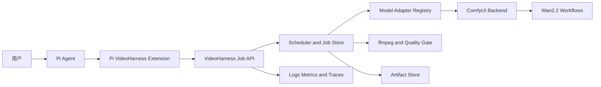

# Pi Video Harness

> A Pi-native harness for planning, running, monitoring, and evaluating local
> video-generation jobs.

Pi Video Harness 的目标，是把 Pi 的 Agent 编排能力与 ComfyUI、Wan 等视频生成后端连接起来，形成一套可扩展、可恢复、可观测、可复现的视频生成框架。

> **项目状态：设计与初始化阶段。** 当前仓库尚未提供可运行版本。本文档描述计划中的架构、接口、范围、实施顺序和验收标准。

## 目录

- [项目目标](#项目目标)
- [范围与非目标](#范围与非目标)
- [设计原则](#设计原则)
- [总体架构](#总体架构)
- [Pi Package 与扩展设计](#pi-package-与扩展设计)
- [VideoHarness 服务](#videoharness-服务)
- [任务模型与状态机](#任务模型与状态机)
- [ComfyUI 后端适配](#comfyui-后端适配)
- [Wan 模型与工作流](#wan-模型与工作流)
- [媒体处理与产物管理](#媒体处理与产物管理)
- [DGX Spark 部署策略](#dgx-spark-部署策略)
- [安全边界](#安全边界)
- [可观测性与错误模型](#可观测性与错误模型)
- [测试策略](#测试策略)
- [计划中的仓库结构](#计划中的仓库结构)
- [配置设计](#配置设计)
- [开发路线图](#开发路线图)
- [计划中的使用方式](#计划中的使用方式)
- [后续扩展方向](#后续扩展方向)
- [参考资料](#参考资料)

## 项目目标

本项目不是简单地让 Pi 调用一次 ComfyUI，而是提供一个稳定的视频任务执行层，使 Agent 能够：

1. 理解用户的视频需求并选择合适的生成模式。
2. 提交文本生成视频（T2V）和图片生成视频（I2V）任务。
3. 查询排队、执行、后处理和验证进度。
4. 取消、重试和恢复耗时较长的视频任务。
5. 返回 MP4、缩略图和完整的生成元数据。
6. 在同一套工具协议下切换 Wan 型号或未来的其他视频后端。
7. 将一次生成扩展为分镜、候选生成、优选和成片编排的闭环。

首个部署目标是单台 NVIDIA DGX Spark，默认运行 Wan2.2-TI2V-5B，并提供 Wan2.2 T2V/I2V-A14B 高质量模式。

## 范围与非目标

### v0.1 范围

- Pi 原生 Extension、Skill 和命令。
- 独立运行的 `videoharnessd` 任务服务。
- 单台 ComfyUI Worker。
- Wan2.2 5B 文生视频和图生视频。
- Wan2.2 A14B 高质量文生视频和图生视频。
- 单生成任务并发。
- 受控的视频预设、宽高比和短片时长。
- 持久化任务状态、取消、重试和重启恢复。
- MP4 标准化、缩略图、基础质量检查和可复现清单。

### v0.1 非目标

- 训练或微调视频基础模型。
- 任意 ComfyUI Custom Node 的自动安装。
- 允许 Agent 提交任意 ComfyUI 节点图。
- 多租户、计费、配额和复杂权限系统。
- 多机并行推理或批量高并发服务。
- 完整 Web 视频编辑器。
- 长视频一次性生成。
- 默认启用 LoRA、ControlNet、GGUF 或社区 Wan Wrapper。

## 设计原则

### 1. 控制面与执行面分离

Pi Extension 只负责理解意图、暴露工具和展示状态。视频任务由独立服务执行，避免 Pi reload、切换会话或退出时中断生成。

### 2. 对 Agent 暴露意图，不暴露节点图

Agent 选择 `mode`、`preset`、宽高比、时长和 seed，不直接编辑 ComfyUI 节点 ID、模型文件名或任意路径。

### 3. 后端和模型分别抽象

ComfyUI 是执行后端，Wan2.2 是模型家族。两者通过独立接口解耦，未来可以接入新的本地运行时或云端视频 API。

### 4. 异步任务优先

视频生成通常需要数分钟。提交工具立即返回 `jobId`，等待操作采用有时限的轮询或事件流，不长时间占住一次 Agent 工具调用。

### 5. 默认安全与可复现

只允许白名单工作流、模型和输入目录；每次运行保存请求、解析结果、seed、模型与工作流版本、输入哈希和产物清单。

### 6. 先保证稳定，再增加节点

首版优先使用 ComfyUI 原生 Wan2.2 工作流和内置视频保存能力。社区节点仅进入锁定版本的实验配置。

## 总体架构



控制面可以运行在开发者电脑上，执行面部署在 DGX Spark 上。ComfyUI 默认只监听执行节点本机，由 `videoharnessd` 提供受控的远程接口。

## Pi Package 与扩展设计

本仓库将作为一个可通过 Git 或 npm 安装的 Pi Package，而不是 fork Pi。计划在 `package.json` 中声明：

```json
{
  "keywords": ["pi-package"],
  "pi": {
    "extensions": ["./extensions"],
    "skills": ["./skills"],
    "prompts": ["./prompts"]
  }
}
```

开发时应基于当前的 [`earendil-works/pi`](https://github.com/earendil-works/pi) 和 `@earendil-works/pi-coding-agent`，并锁定经过测试的 Pi 版本。

### 首版 Pi 工具

| 工具 | 作用 | 主要返回值 |
| --- | --- | --- |
| `video_generate` | 验证需求、解析预设并异步提交任务 | `jobId`、解析后的模型与预设、预计资源需求 |
| `video_job` | 执行 `status`、`wait`、`cancel`、`retry` 或 `result` | 状态、进度、错误或产物引用 |
| `video_capabilities` | 查询服务健康度、模型、模式、预设及限制 | Worker、模型和设备能力快照 |

`video_job` 的 `wait` 操作应是有上限的长轮询，例如单次最多等待 30–60 秒；超时只表示本次等待结束，不表示生成失败。

扩展应使用 Pi 工具接口提供的：

- `onUpdate`：把排队、采样、VAE 解码、后处理等进度显示给用户。
- `AbortSignal`：用户停止等待时终止客户端等待；是否取消服务端任务由明确的 `cancel` 操作决定。
- `executionMode: "sequential"`：避免同一 Agent turn 内并行发起多个 GPU 任务。
- `renderCall` / `renderResult`：显示任务卡片、缩略图和关键参数。
- `session_start`：恢复当前会话关联的任务状态。
- `session_shutdown`：关闭客户端连接，但不取消服务端任务。

### Skill 与命令

计划内置 `video-director` Skill，用于指导 Agent：

- 判断使用 T2V 还是 I2V。
- 把抽象需求转换为主体、动作、环境、镜头、光照和风格描述。
- 根据迭代阶段选择 `preview`、`balanced` 或 `quality`。
- 对较长需求先拆分镜头，不请求模型一次生成长视频。
- 保留原始 prompt，并将增强后的 prompt 单独记录。

计划提供 `/video` 命令和进度 Widget，用于查看当前任务、打开结果和取消任务。

### 视频结果在 Pi 中的表示

当前 Pi Tool Result 主要承载文本与图片内容，因此工具结果计划返回：

- MP4 的绝对路径或受控 URL。
- PNG/JPEG 缩略图，供 Pi 界面直接预览。
- `details.artifacts` 中的结构化视频元数据。
- 不把 MP4 以 base64 形式放入 LLM 上下文。

Pi 会话只用于关联和展示任务。任务状态的事实来源始终是 VideoHarness 数据库与 ComfyUI 历史记录。

## VideoHarness 服务

`videoharnessd` 是独立的 TypeScript/Node.js 服务，部署在 ComfyUI 附近，负责：

- 验证和规范化外部请求。
- 管理队列、幂等键和任务状态机。
- 选择模型与预设。
- 编译白名单工作流。
- 与 ComfyUI HTTP/WebSocket API 通信。
- 重连后与 ComfyUI history 对账。
- 执行后处理、质量检查和产物登记。
- 提供健康检查、结构化日志和指标。

### 计划中的 HTTP 接口

| 方法与路径 | 作用 |
| --- | --- |
| `GET /v1/health` | 服务、数据库和 ComfyUI 健康检查 |
| `GET /v1/capabilities` | 返回模型、预设、设备与当前限制 |
| `POST /v1/assets` | 上传并校验 I2V 输入素材 |
| `POST /v1/jobs` | 创建幂等的视频生成任务 |
| `GET /v1/jobs/:jobId` | 获取任务状态与进度 |
| `GET /v1/jobs/:jobId/events` | 通过 SSE 或长轮询获取任务事件 |
| `POST /v1/jobs/:jobId/cancel` | 取消排队或运行中的任务 |
| `POST /v1/jobs/:jobId/retry` | 按原始请求创建可追踪的重试任务 |
| `GET /v1/jobs/:jobId/artifacts` | 获取视频、缩略图和 manifest |

接口实现应生成并贯穿使用 `requestId`、`jobId`、`runId`、`backendPromptId` 和 `piSessionId`。

### 核心请求模型

```ts
type VideoMode = "t2v" | "i2v";
type VideoPreset = "preview" | "balanced" | "quality";
type AspectRatio = "16:9" | "9:16" | "1:1";

interface GenerateVideoInput {
  mode: VideoMode;
  prompt: string;
  negativePrompt?: string;
  inputAssetId?: string;
  preset?: VideoPreset;
  aspectRatio?: AspectRatio;
  durationSeconds?: number;
  seed?: number;
  dryRun?: boolean;
  idempotencyKey?: string;
}
```

`dryRun` 只执行能力检查、参数解析、模型选择和资源估算，不向 ComfyUI 提交任务。

## 任务模型与状态机

```text
queued
  -> preflight
  -> submitted
  -> running
  -> postprocessing
  -> validating
  -> completed

任意执行阶段可进入 failed 或 cancelled。
```

### 状态要求

- 状态变化必须持久化后再通知客户端。
- 每次变化记录时间戳、原因和关联的后端事件。
- Worker 重启后，对 `submitted` 和 `running` 任务查询 ComfyUI queue/history。
- 无法确认结果时进入可诊断的恢复状态，不静默标记成功或重新提交。
- 重试创建新的 `runId`，并保留与原任务的父子关系。
- 相同幂等键和相同请求不得重复创建生成任务。

首版使用 SQLite WAL 保存任务、运行、事件、素材和产物记录。Pi Session 不是任务数据库。

## ComfyUI 后端适配

首版实现 `ComfyUIBackend`，封装以下 ComfyUI 原生接口：

| ComfyUI 接口 | VideoHarness 用途 |
| --- | --- |
| `POST /prompt` | 验证并提交 API-format workflow |
| `GET /queue` | 对账等待和运行任务 |
| `GET /history/:promptId` | 获取最终状态、错误和输出 |
| `GET /system_stats` | 获取设备和可用内存信息 |
| `GET /object_info` | 验证工作流所需节点是否存在 |
| `POST /upload/image` | 上传 I2V 输入图片 |
| `GET /view` | 读取后端产物或预览 |
| `POST /queue` | 移除尚未运行的队列任务 |
| `POST /interrupt` | 中断当前运行任务 |
| `POST /free` | 在模型切换时请求释放模型与缓存 |
| `WS /ws` | 接收实时执行状态和进度 |

WebSocket 事件需要映射为内部统一事件，包括：

- `execution_start`
- `execution_cached`
- `executing`
- `progress`
- `executed`
- `execution_success`
- `execution_error`
- `execution_interrupted`
- `status`

WebSocket 断开后必须退回 history/queue 轮询，不能因为失去连接就把任务判为失败。

### 后端接口

```ts
interface VideoBackend {
  health(): Promise<BackendHealth>;
  submit(graph: ComfyPromptGraph, metadata: RunMetadata): Promise<BackendJobRef>;
  watch(ref: BackendJobRef, signal: AbortSignal): AsyncIterable<JobEvent>;
  get(ref: BackendJobRef): Promise<BackendJob>;
  cancel(ref: BackendJobRef): Promise<void>;
  free?(request: FreeResourcesRequest): Promise<void>;
}
```

## Wan 模型与工作流

### 首批模型适配器

| Adapter ID | 模型 | 模式 | 默认用途 |
| --- | --- | --- | --- |
| `wan22-ti2v-5b` | Wan2.2-TI2V-5B | T2V、I2V | `preview`、`balanced` |
| `wan22-t2v-a14b` | Wan2.2-T2V-A14B | T2V | `quality` |
| `wan22-i2v-a14b` | Wan2.2-I2V-A14B | I2V | `quality` |

模型路由必须是确定性的：预设、模式、设备能力和配置共同决定模型，不让 LLM 自由填写权重文件或节点名称。

### 模型适配器接口

```ts
interface VideoModelAdapter {
  capabilities(): ModelCapabilities;
  normalize(input: GenerateVideoInput, device: DeviceSnapshot): ResolvedRequest;
  estimate(input: ResolvedRequest): ResourceEstimate;
  compile(input: ResolvedRequest): ComfyPromptGraph;
  collect(history: unknown): BackendArtifactRef[];
}
```

### 工作流包

每套工作流由 API-format JSON 和 manifest 组成。manifest 至少记录：

- `workflowId`、版本和内容哈希。
- 支持的模式、宽高比、时长和预设。
- 所需 ComfyUI node class。
- 模型文件名、revision 和 checksum。
- 外部参数到节点输入的绑定关系。
- 预期输出节点与媒体类型。
- 已验证的 ComfyUI、CUDA、PyTorch 和平台版本。

服务只 patch manifest 中声明的可变参数。禁止调用方上传或执行任意 workflow。

### 首版预设

| 预设 | 路由 | 目标 |
| --- | --- | --- |
| `preview` | 5B、较低工作分辨率、最短支持片段 | 快速验证构图和动作方向 |
| `balanced` | 5B、模型支持的 720p 尺寸、3–5 秒 | 默认生成模式 |
| `quality` | A14B FP8、模型支持的 720p 尺寸、3–5 秒 | 高质量慢任务 |

具体像素和帧数由 Adapter 映射为模型兼容值，不直接接受任意 width、height 或 frame count。

## 媒体处理与产物管理

### 输入处理

- 校验文件 MIME、真实解码格式、尺寸、像素数和文件大小。
- Pi 本地图片由 Extension 计算哈希并上传为 `assetId`，不假设控制端与 DGX Spark 共享文件系统。
- 默认不接受任意远程 URL，避免 SSRF 和不受控下载。
- 使用真实路径解析和符号链接检查阻止目录穿越。

### 输出处理

生成结束后使用 `ffmpeg` 和 `ffprobe`：

- 转换为标准 H.264 MP4。
- 规范化帧率、像素格式和音视频容器。
- 生成 poster、缩略图和可选低码率预览。
- 验证视频可以解码。
- 检查宽高、fps、duration、frame count 和文件大小。
- 执行基础黑帧、全程冻结或空输出检测。

### 产物目录

```text
data/runs/<jobId>/
├── request.json
├── resolved-request.json
├── workflow.json
├── events.jsonl
├── output.mp4
├── poster.jpg
└── manifest.json
```

`manifest.json` 应记录：

- 原始 prompt 与解析/增强后的 prompt。
- negative prompt 和 seed。
- 模型 ID、revision、精度和 checksum。
- 工作流 ID、版本和哈希。
- ComfyUI 与 VideoHarness 版本。
- 输入文件哈希。
- 采样、尺寸、时长和帧率参数。
- 设备、各阶段耗时和峰值资源信息。
- 输出文件的 MIME、尺寸、时长、哈希和相对路径。

可复现指的是请求、依赖和执行条件可追踪；不承诺不同硬件或底层实现下得到字节完全相同的视频。

## DGX Spark 部署策略

DGX Spark 的 128GB 是 CPU/GPU 统一内存，因此 CPU offload 不会增加总容量。首版调度策略：

- `maxConcurrentGenerations = 1`。
- 默认常驻或优先使用 Wan2.2-TI2V-5B。
- A14B 进入高质量慢队列。
- 模型切换前调用释放流程并重新检查资源。
- 为系统、Pi、ComfyUI 和后处理保留可配置的内存余量；初始建议值在硬件测试后确定。
- A14B 运行时不同时常驻大型本地控制 LLM。
- 提交前检查可用统一内存、磁盘水位和 ComfyUI 队列。
- 后处理可以与轻量操作并行，但避免 ffmpeg、VAE 和新一轮采样争抢资源。
- 首版仅开放短片和固定宽高比，不开放任意分辨率或长时长。

部署包计划包含：

- NVIDIA/DGX Spark 兼容的安装与自检脚本。
- ComfyUI、PyTorch、CUDA 和模型 revision 锁定文件。
- `videoharnessd` systemd 服务示例。
- 数据、模型和日志目录约定。
- 健康检查与磁盘清理策略。

## 安全边界

Pi Extension 运行时拥有启动用户的系统权限，ComfyUI Custom Node 也可以执行代码，因此首版采用以下边界：

1. ComfyUI 只监听 `127.0.0.1`，不直接暴露到公网或普通局域网。
2. 远程 Pi 只连接带鉴权的 VideoHarness API。
3. 工作流、模型、预设、输入和输出路径全部采用 allowlist。
4. 不允许 Agent 安装依赖、下载模型或加载 Custom Node。
5. 不允许任意 URL 输入和任意 ComfyUI graph 执行。
6. 限制输入文件大小、像素数和视频时长。
7. 所有密钥通过环境变量或秘密管理系统注入，不写入 Git。
8. 日志隐藏 token、完整用户隐私数据和不必要的 prompt 内容。
9. 自动重试只适用于临时后端错误，OOM 或配置错误不能无限重试。
10. 后续内容安全、真人/未成年人规则和来源标记通过独立 Policy Hook 接入。

第三方节点未来只能进入显式开启的 `experimental` profile，并锁定来源、commit、文件哈希和依赖清单。

## 可观测性与错误模型

### 指标

- 队列等待时间。
- 模型加载与切换时间。
- 采样、VAE、后处理和端到端耗时。
- 成功、失败、取消和重试数量。
- OOM 与工作流兼容错误数量。
- 峰值统一内存与磁盘使用量。
- 生成视频的时长与输出字节数。

计划使用结构化日志，并逐步接入 OpenTelemetry/Prometheus。所有日志和事件通过 `jobId`、`runId` 与 `backendPromptId` 关联。

### 标准错误码

| 错误码 | 是否可自动重试 | 含义 |
| --- | --- | --- |
| `invalid_request` | 否 | 输入或参数不合法 |
| `missing_asset` | 否 | 输入素材不存在或校验失败 |
| `missing_model` | 否 | 模型文件或 revision 不符合 manifest |
| `workflow_incompatible` | 否 | 缺少节点或工作流版本不匹配 |
| `insufficient_memory` | 否 | 预检发现内存不足 |
| `backend_unavailable` | 是 | ComfyUI 暂时不可访问 |
| `backend_timeout` | 有限重试 | 后端在约定时间内无响应 |
| `backend_oom` | 否 | ComfyUI 执行时 OOM |
| `execution_failed` | 视原因决定 | 节点执行失败 |
| `decode_failed` | 有限重试 | 输出无法被 ffprobe/ffmpeg 正常读取 |
| `quality_gate_failed` | 可配置 | 输出未通过基础质量检查 |
| `cancelled` | 否 | 用户或系统明确取消 |

默认只对可恢复的传输错误自动重试一次，并使用新的 `runId`。

## 测试策略

### 单元测试

- 请求 schema 与参数规范化。
- preset 和 model routing。
- 状态机合法转换。
- 幂等键与重试关系。
- workflow 参数绑定和哈希。
- 路径、MIME、尺寸和安全校验。

### Contract 测试

- 使用 Fake ComfyUI Server 覆盖成功、进度、断线、错误和取消。
- 验证 `/prompt`、WebSocket、queue 和 history 的映射。
- 固定 API-format workflow snapshot，防止节点绑定意外变化。

### 集成测试

- Pi Extension 能安装并注册三个工具。
- `video_generate -> video_job -> artifact` 完整链路。
- 服务重启后恢复未完成任务。
- WebSocket 断开后通过轮询继续得到最终结果。
- 取消排队任务和当前运行任务。

### DGX Spark 硬件 Smoke Test

- 5B T2V preview。
- 5B I2V preview。
- 5B balanced 720p 短片。
- A14B T2V quality。
- A14B I2V quality。
- 模型切换、资源释放和低磁盘水位保护。

CI 不下载大型权重。常规 CI 使用 Fake Backend；真实模型测试在带标签的 DGX Spark Runner 上手动或定时执行。

## 计划中的仓库结构

```text
pi-video-harness/
├── apps/
│   └── videoharnessd/            # 独立任务服务与 HTTP API
├── extensions/
│   └── video-harness/            # Pi Extension、工具和 TUI 渲染
├── packages/
│   ├── contracts/                # TypeBox schema、事件与错误类型
│   ├── core/                     # Job、Scheduler、Registry、Artifact
│   ├── backend-comfyui/          # ComfyUI HTTP/WebSocket Adapter
│   ├── model-wan/                # Wan Adapter 和预设策略
│   └── media/                    # ffmpeg、ffprobe 与质量检查
├── skills/
│   └── video-director/
│       └── SKILL.md
├── prompts/                      # Pi 命令与分镜模板
├── workflows/
│   └── wan2.2/
│       ├── ti2v-5b/
│       ├── t2v-a14b/
│       └── i2v-a14b/
├── deploy/
│   └── dgx-spark/                # 安装、自检和服务配置
├── tests/
│   ├── fixtures/
│   ├── contract/
│   └── hardware/
├── docs/                         # ADR、API 与部署文档
├── package.json
└── README.md
```

## 配置设计

计划提供 `.env.example`，至少包含：

```dotenv
VIDEOHARNESS_HOST=127.0.0.1
VIDEOHARNESS_PORT=8787
VIDEOHARNESS_DATA_DIR=./data
VIDEOHARNESS_AUTH_TOKEN=replace-with-a-secret

COMFYUI_BASE_URL=http://127.0.0.1:8188
COMFYUI_WS_URL=ws://127.0.0.1:8188/ws

VIDEOHARNESS_MAX_CONCURRENT_GENERATIONS=1
VIDEOHARNESS_DEFAULT_PRESET=balanced
VIDEOHARNESS_ALLOWED_MODELS=wan22-ti2v-5b,wan22-t2v-a14b,wan22-i2v-a14b
VIDEOHARNESS_MIN_FREE_DISK_GIB=100
VIDEOHARNESS_MEMORY_RESERVE_GIB=20
```

示例值不是最终硬件基准。内存和磁盘阈值必须通过 DGX Spark 实测调整。真实 token 不得提交到仓库。

## 开发路线图

### Phase 0：工程骨架与契约

交付内容：

- 初始化 Node.js/TypeScript workspace。
- 建立 Pi Package manifest。
- 定义请求、任务、事件、错误与 artifact schema。
- 实现状态机、配置加载和 Fake Backend。
- 建立 lint、typecheck、unit test 和 CI。

验收标准：

- Pi 能从本地加载 Extension。
- `video_capabilities` 能返回 Fake Backend 能力。
- Fake 任务能完成 submit、wait、cancel、retry 和 result 流程。

### Phase 1：Wan2.2-5B 最小端到端

交付内容：

- `videoharnessd`、SQLite 和单机 Scheduler。
- ComfyUI HTTP/WebSocket Adapter。
- 5B T2V/I2V API-format workflow 与 manifest。
- 三个 Pi 工具和基础进度 UI。
- ffmpeg 标准化、poster 和 manifest。

验收标准：

- 用户能从 Pi 提交 5B T2V 和 I2V 任务。
- 最终返回可播放 MP4、缩略图和完整元数据。
- 排队任务和运行任务可以取消。
- Extension 或服务重启后任务可以恢复或明确说明恢复失败原因。

### Phase 2：DGX Spark 与 A14B 加固

交付内容：

- DGX Spark 安装、自检和服务脚本。
- 内存、磁盘、模型和节点预检。
- T2V/I2V-A14B FP8 workflow。
- 模型释放与切换策略。
- 硬件 smoke test 和性能基线。

验收标准：

- 单台 DGX Spark 稳定完成 5B 和 A14B 标准测试任务。
- A14B 不会与另一个生成任务并行执行。
- OOM、缺少模型和节点不兼容能返回明确错误。
- 每个基准记录峰值内存和各阶段耗时。

### Phase 3：生成质量闭环

交付内容：

- `video-director` Skill 和 prompt compiler。
- 自然语言到 shot list 的分镜规划。
- 多 seed preview、候选打分和人工选择。
- 基础语义、美学、黑帧、冻结和时序质量检查。
- 选中候选后使用 quality preset 重跑。

验收标准：

- 一个多镜头需求可以生成结构化 shot plan。
- 每个镜头保留候选、选择依据和最终版本关系。
- 自动增强可以关闭，原始 prompt 永远保留。

### Phase 4：成片与多后端

候选方向：

- 镜头拼接、转场、字幕、TTS、配乐和封面。
- 首尾帧、S2V、视频延长与局部编辑。
- 角色与参考素材库。
- HunyuanVideo、LTX 等本地 Adapter。
- 云端视频 API Adapter。
- 多 Worker 调度、对象存储和 Web Gallery。
- 内容安全 Policy Hook、来源说明、C2PA 或水印。

## 计划中的使用方式

第一个可发布版本打 tag 后，计划支持：

```bash
pi install git:github.com/qinyh10300/pi-video-harness@v0.1.0
```

交互示例：

```text
用户：生成一个 5 秒、16:9 的电影感视频：雨夜的上海街头，
     一辆复古出租车从霓虹灯下驶过。先做预览。

Pi：调用 video_generate，preset=preview
VideoHarness：返回 jobId 和解析后的生成计划
Pi：调用 video_job(action=wait)
VideoHarness：返回进度、MP4 路径、缩略图和 manifest
```

正式发布前，不应将上述安装命令视为可用版本。

## 后续扩展方向

第三方能力按 Adapter 或实验 Profile 引入，而不是写入核心：

- GGUF/量化：用于显存更小的设备。
- Wan 高级 Wrapper：用于实验性控制和加速能力。
- LoRA、ControlNet、Pose 和 Camera Control。
- 视频超分、补帧、去闪烁和音频生成。
- 自动评审模型和候选重排序。
- S3 兼容存储与远程 Worker。

所有第三方依赖必须记录许可证、来源、版本、commit、checksum 和 ARM64/CUDA 兼容状态。

## 参考资料

- [Pi Agent Harness](https://github.com/earendil-works/pi)
- [Pi Extensions](https://github.com/earendil-works/pi/blob/main/packages/coding-agent/docs/extensions.md)
- [Pi Packages](https://github.com/earendil-works/pi/blob/main/packages/coding-agent/docs/packages.md)
- [Pi SDK](https://github.com/earendil-works/pi/blob/main/packages/coding-agent/docs/sdk.md)
- [ComfyUI Server API](https://docs.comfy.org/development/comfyui-server/comms_routes)
- [ComfyUI WebSocket Messages](https://docs.comfy.org/development/comfyui-server/comms_messages)
- [ComfyUI Wan2.2 Native Workflows](https://docs.comfy.org/tutorials/video/wan/wan2_2)
- [Wan2.2](https://github.com/Wan-Video/Wan2.2)
- [NVIDIA DGX Spark Hardware](https://docs.nvidia.com/dgx/dgx-spark/hardware.html)
- [NVIDIA DGX Spark ComfyUI Playbook](https://build.nvidia.com/spark/comfy-ui/instructions)

## License

[Apache License 2.0](LICENSE)
