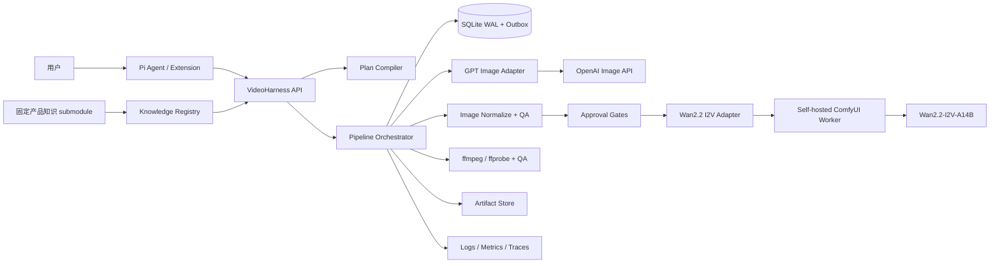

# Pi Video Harness

> A Pi-native harness for planning, approving, running, monitoring, and
> evaluating first-frame-driven video pipelines.

Pi Video Harness 把 Pi 可调用的工具边界与独立 Pipeline 服务分开，目标是将 OpenAI
Image
API、ComfyUI 和 Wan2.2 连接成一条可恢复、可观测、可追踪的首帧驱动视频工作流。

> **项目状态：Phase A 离线实现已完成，可在本机运行。**
> 当前可用的是无网络、无付费调用的 Fake Pipeline：包含 contracts、SQLite
> WAL、Outbox/幂等、四个人工 Gate、HTTP API、Pi-compatible
> HTTP 客户端/工具定义和重启恢复测试。Fake video 是测试专用 JSON
> payload，**不是 MP4，不是真实成片**。GPT-Image-2 和 ComfyUI/Wan2.2-I2V-A14B 适配器仍是明确禁用的无网络占位实现；即使填入密钥或 URL 也不会发起供应商请求。已接受的架构决策见
> [ADR-0001](docs/adr/0001-gpt-image-2-wan22-i2v-a14b-pipeline.md)，实现契约和验收标准见[开发规格](docs/development/gpt-image-2-wan22-i2v-a14b.md)，当前进度见
> [实现状态](docs/development/implementation-status.md)。

## 快速开始（离线 Fake Pipeline）

需要 Node.js 24+ 和 pnpm 11.19.0。默认服务只监听 `127.0.0.1:8787`，使用
`fake-image2-video-v1`，不需要 OpenAI Key、ComfyUI 或 GPU。

```bash
git submodule update --init --recursive
pnpm install --frozen-lockfile
pnpm check
pnpm dev
```

第一条命令拉取被 gitlink 固定的产品知识快照；Harness 不会在启动时跟随上游分支更新，也不会安装或执行该外部仓库中的脚本。

`pnpm dev` 和构建后的 `pnpm start` 都会在文件存在时自动加载仓库根目录的
`.env`；不创建 `.env` 则使用安全默认值。需要覆盖默认值时可先执行
`cp .env.example .env`，但不要把真实密钥提交到 Git。启动成功后服务会打印监听地址、API 版本、Phase、`offline_fake`
执行模式、默认 Profile 和鉴权状态，不打印 Token。

在另一个终端确认服务和外部后端状态：

```bash
export NO_PROXY=127.0.0.1,localhost
curl -sS http://127.0.0.1:8787/v1/health | jq
curl -sS http://127.0.0.1:8787/v1/capabilities | jq
```

下面的最小流程会创建计划和 draft
Pipeline，再依次通过计划、选图、选视频预览和最终验收四个 Gate。需要
`jq`；所有产物都是本地测试数据。

```bash
RUN_ID="$(date +%s)-$$-${RANDOM:-0}"

PLAN=$(curl -sS -X POST http://127.0.0.1:8787/v1/plans \
  -H 'content-type: application/json' \
  -d "$(jq -n --arg key "readme-plan-$RUN_ID" \
    '{brief:"A paper boat moves slowly across a still pond.",dryRun:true,idempotencyKey:$key}')")

VIEW=$(curl -sS -X POST http://127.0.0.1:8787/v1/pipelines \
  -H 'content-type: application/json' \
  -d "$(jq -n --arg planId "$(jq -r .planId <<<"$PLAN")" \
    --arg expectedPlanHash "$(jq -r .planHash <<<"$PLAN")" \
    --arg key "readme-pipeline-$RUN_ID" \
    '{planId:$planId,expectedPlanHash:$expectedPlanHash,idempotencyKey:$key}')")

DECISION_NUMBER=0
decide_open_gate() {
  ACTION=$1
  SELECTED=${2:-}
  DECISION_NUMBER=$((DECISION_NUMBER + 1))
  GATE_ID=$(jq -r '.gates[] | select(.status == "open") | .gateId' <<<"$VIEW")
  VERSION=$(jq -r '.gates[] | select(.status == "open") | .expectedPipelineVersion' <<<"$VIEW")
  BODY=$(jq -n --arg action "$ACTION" --arg selected "$SELECTED" \
    --argjson version "$VERSION" --arg key "readme-decision-$RUN_ID-$DECISION_NUMBER" \
    '{action:$action,expectedPipelineVersion:$version,idempotencyKey:$key}
     + if $selected == "" then {} else {selectedArtifactId:$selected} end')
  VIEW=$(curl -sS -X POST \
    "http://127.0.0.1:8787/v1/pipelines/$(jq -r .pipeline.pipelineId <<<"$VIEW")/gates/$GATE_ID/decisions" \
    -H 'content-type: application/json' -d "$BODY")
}

decide_open_gate approve
decide_open_gate select "$(jq -r '.gates[] | select(.status == "open") | .candidateArtifactIds[0]' <<<"$VIEW")"
decide_open_gate select "$(jq -r '.gates[] | select(.status == "open") | .candidateArtifactIds[0]' <<<"$VIEW")"
decide_open_gate approve
jq '{status:.pipeline.status}' <<<"$VIEW"
curl -sS \
  "http://127.0.0.1:8787/v1/pipelines/$(jq -r .pipeline.pipelineId <<<"$VIEW")/artifacts" \
  | jq '{pipelineStatus,resultReady,acceptedArtifactIds,
         artifacts:[.artifacts[] | {kind,mimeType,current,accepted,contentPath}]}'
```

## 版本化视频脚本

多镜头创意脚本统一保存在
[`config/video-scripts`](config/video-scripts/README.md)，按产品或活动分目录，文件名使用
`<scriptId>.v<scriptVersion>.json`。`VideoScriptRegistry`
会递归加载并校验版本、文件名、重复镜头和连续时间线；
`createPlanInputsForVideoScript`
会把每个脚本稳定展开为现有 Pipeline 可接受的多个 5 秒镜头输入。

运行或登记活动时应显式保存
`scriptId + scriptVersion + scriptHash`，不要隐式选择最新版本。当前示例是 15 秒竖屏的车延保旅行故障情景脚本。

## 车援宝产品知识环

力众华援产品知识库以只读 Git submodule 保存在
[`knowledge/lynxon-product-knowledge`](knowledge/lynxon-product-knowledge/)，当前锁定完整commit
`4be08769b2e3459075490c7ab31924178ab44cd8`。运行时 allowlist 只开放
`01-PRODUCT/**/*.md`，且只有 `verification: verified` 并声明非空
`assistant_contract`
的文档进入权威 corpus；Harness 永不执行外部仓库中的 Agent 指令、安装钩子、构建脚本或服务。

客户内容使用官方名称“车援宝”，产品类别是“机动车辆延长保修服务”，不能写成“车元宝”，也不能描述成保险。简单问答通过
`POST /v1/knowledge/queries` 或 Pi 工具 `product_knowledge_qa`
返回预先批准的确定性答案与引用；没有唯一证据时返回
`insufficient_evidence`，不会自由补写。

产品 Plan 绑定知识 snapshot、`corpusHash`、`policyHash` 和
`bindingHash`，这些内容进入 `planHash`。`plan_approval`
前，选中的问答/claim 必须作为独立逐字行进入 Brief；移除批准片段后，Brief 与 Prompt 中不允许残留品牌、品类、购买时点、保障/赔付/报修或绝对承诺话术，避免用一条合法引用或批准原文后缀夹带矛盾事实。`plan_approval`
后、首个图片模型调用前，`knowledge_validate` 本地 Stage 验证绑定并写入
`qa_report`；恢复以及每次图片预览、视频预览、最终视频和对应 reroll 的后端调用前都会复验。失败时 Pipeline 进入
`needs_attention`，且不会提交紧随其后的模型调用；Backend 恢复会在启动、对账或导入结果前复验，最终验收前也会复验。首次校验失败时全部图片/视频调用数为零。详见
[知识 Grounding 设计](docs/development/knowledge-grounding.md)和
[知识源更新说明](knowledge/README.md)。

这里的严格保障对象是受控脚本、Brief、overlay、voiceover 的公开产品事实与 Plan 绑定。它不证明知识库自身绝对正确，也不表示尚无 OCR/ASR 的真实画面文字和最终音轨已完成全量语义验证。

最终状态应为 `completed`。`video_final` 的 MIME 是
`application/vnd.pi-video-harness.fake-video+json`；这是可重复的测试契约，不能当作可播放视频。如果设置了
`VIDEOHARNESS_AUTH_TOKEN`，所有 curl 请求还需添加
`Authorization: Bearer <token>`。

产物集合会保留当前项和已被 reroll/上游变更淘汰的历史项。`current`
表示产物未被标记为 `superseded`；`accepted`
只会在 Pipeline 已完成时标记当前且被最终验收的
`video_final`，派生 poster/thumbnail 不会因此自动标记为已验收。`resultReady`
等价于 `acceptedArtifactIds` 非空。`contentPath`
是需要走同一鉴权的受控 API 相对路径，不是本地文件路径；客户端不应直接拼接或读取内部
`storagePath`。

## v0.1 真实模型交付目标

以下是 Phase B–D 将完成的真实模型垂直切片，不是 Phase A 已可用能力：

```text
创意 Brief
  -> 无费用的生成计划与人工确认
  -> GPT-Image-2 首帧候选与人工选图
  -> 图片标准化
  -> Wan2.2-I2V-A14B 480P 预览候选与人工选择
  -> Wan2.2-I2V-A14B 720P 成片
  -> ffmpeg 后处理、质量检查与产物登记
```

模型身份固定为：

- 图片：OpenAI Image API 的 `gpt-image-2-2026-04-21` 快照；
- 视频：我们控制权重和运行时的开源 `Wan2.2-I2V-A14B`；
- 视频运行时：自托管 ComfyUI Worker，可部署在专用云 GPU 或经过验证的 DGX
  Spark 上。

百炼
`wan2.2-i2v-plus`、`Wan2.2-TI2V-5B`、Seedance、Kling、GGUF 或社区 Wrapper 均不属于 v0.1 默认路径，也不得作为静默回退。目标 checkpoint 或运行条件不满足时，Pipeline 应明确失败。

## 范围与非目标

### v0.1 目标范围

- Pi 原生 Extension、Skill 和四个工具；
- 独立运行的 `videoharnessd` Pipeline 服务；
- `PipelineRun`、`StageRun`、`ApprovalGate` 和完整 Artifact lineage；
- GPT-Image-2 新图、参考图编辑、候选选择与图片标准化；
- 精确 A14B 的 480P 预览和 720P 成片；
- 16:9 与 9:16、81 帧、16 fps、名义约 5 秒的短片；
- 持久化状态、幂等、有限重试、取消和进程重启恢复；
- H.264 MP4、poster、缩略图、QA 报告和可复现 manifest；
- 图片 API 用量、GPU 阶段耗时与成本估算。

### v0.1 非目标

- 文生视频、TI2V、1:1 画幅或长视频；
- 多镜头自动剪辑、字幕、TTS、配乐或完整 Web 编辑器；
- 自动训练、LoRA、ControlNet、GGUF 或第三方 Wan Wrapper；
- 把百炼 Plus 或其他托管视频模型描述为 A14B 的同权重别名；
- 多租户、复杂计费、多机并发调度或无人值守自动验收；
- 允许 Agent 上传任意 ComfyUI workflow 或安装 Custom Node；
- 跨硬件、驱动和运行时的字节级确定性。

## 设计原则

1. **意图与执行分离**：Pi 负责理解需求、展示计划和收集选择；独立服务负责付费调用、GPU 任务、恢复与产物管理。
2. **先计划再计费**：`dryRun`
   只创建并验证计划、估算资源，不调用 OpenAI，也不向 ComfyUI 提交任务。
3. **模型身份优先**：模型 ID、快照、checkpoint、精度配置和 checksum 必须可追踪；不可用时不自动换模型。
4. **Prompt 分工明确**：`stillPrompt` 只负责可见首帧，`motionPrompt`
   只负责五秒内动态，`negativePrompt` 主要供 Wan 阶段使用。
5. **人工 Gate 是领域对象**：计划、首帧、动作预览和成片分别确认，不能用一个布尔字段压缩整个审批过程。
6. **付费副作用可恢复**：提交意图先持久化；超时或重启后先对账，不能因响应不确定而盲目重复调用。
7. **上游变更使下游失效**：修改 Prompt 或首帧后，旧的下游 Stage 标记为
   `superseded`，不能再晋级。
8. **只执行白名单工作流**：Agent 选择模式和预设，不直接操作节点 ID、权重文件名、任意路径或 ComfyUI
   graph。
9. **产品事实先绑定再生成**：受保护产品内容必须来自固定知识快照和批准 policy；
   `knowledge_validate` 未通过时不得触发图片或视频模型。

## 总体架构

下图是目标架构。Phase A 已运行 API、Planner、Orchestrator、SQLite WAL/
Outbox、Artifact
Store 和 Gate；图中 OpenAI、ComfyUI、A14B 和真实媒体 QA 尚未接通，执行位置由 Fake
Backends 代替。



当前控制面可运行在这台开发电脑上，且不发起出站模型请求。目标实现中，图片阶段才会通过受控 HTTPS 调用 OpenAI；视频执行面部署在云 GPU 或 DGX
Spark。ComfyUI 不直接暴露给 Pi 或公网。

## Pipeline 与人工确认

### Stage 顺序

下表是真实模型目标 Stage。Phase
A 保留相同的四 Gate 交互与 lineage 结构，但图片/视频内容来自确定性 Fake
Backend，不执行真实标准化或 ffmpeg QA。

| 顺序 | Stage                | 产物                                    | 后续 Gate                                  |
| ---- | -------------------- | --------------------------------------- | ------------------------------------------ |
| 0    | `plan_compile`       | 结构化 Shot Plan 与成本/资源估算        | 创建 draft Pipeline 后打开 `plan_approval` |
| 1    | `knowledge_validate` | 固定知识绑定的本地 `qa_report`          | 仅知识绑定 Plan；通过后才可调用模型        |
| 2    | `image_preview`      | 默认 2 张 GPT-Image-2 候选              | —                                          |
| 3    | `image_validate`     | 技术 QA、排序和风险提示                 | `image_selection`                          |
| 4    | `image_final`        | 选中图或通过 `images.edit` 得到的精修图 | 可选确认                                   |
| 5    | `frame_normalize`    | 符合 `FrameSpec` 的 Wan 输入帧          | —                                          |
| 6    | `video_preview`      | 默认 2 个 A14B 480P seed                | —                                          |
| 7    | `video_validate`     | 视频 QA、排序和风险提示                 | `video_selection`                          |
| 8    | `video_final`        | A14B 720P 原始成片                      | —                                          |
| 9    | `video_postprocess`  | MP4、poster、thumbnail、manifest        | `final_acceptance`                         |

`knowledge_validate` 首次发生在 `plan_approval` 通过之后、`image_preview`
之前，并在后续每个图片/视频后端入口复验；无知识绑定的通用视频不会创建该 Stage。

自动 QA 负责硬校验、排序与风险提示，不代替审美选择。480P 预览晋级 720P 时复用首帧、Prompt 版本和被选 seed，但分辨率变化仍可能导致动作差异，不能承诺逐帧一致。

### 真实模型目标规格

| 项目             | 默认值                                       |
| ---------------- | -------------------------------------------- |
| 图片模型         | `gpt-image-2-2026-04-21`                     |
| 图片候选         | 2 张 `medium` PNG                            |
| 横屏首帧         | `1280x720`                                   |
| 竖屏首帧         | `720x1280`                                   |
| 图片交接         | opaque、sRGB、8-bit、3 通道 RGB              |
| 视频模型         | `wan22-i2v-a14b`                             |
| 视频预览         | A14B、480P 面积档、2 个 seed                 |
| 视频成片         | A14B、720P 面积档、81 帧、16 fps             |
| Worker 并发      | 每个 Worker 1 个生成任务                     |
| Prompt Extension | 默认关闭；如开启必须在计划阶段展示并固定版本 |

## Pi Package 与工具

当前 `extensions/video-harness` 已提供独立 HTTP
Client 和四个 Pi-compatible 工具定义。它们已有单元测试，但**尚未通过正式 Pi
SDK 注册，也不是可直接 `pi install` 的已发布 Package**。目标 Package
metadata 为：

```json
{
  "keywords": ["pi-package"],
  "pi": {
    "extensions": ["./extensions"],
    "skills": ["./skills"],
    "prompts": ["./prompts"]
  }
}
```

### 首版工具

| 工具                   | 作用                                                                                             | 主要返回值                              |
| ---------------------- | ------------------------------------------------------------------------------------------------ | --------------------------------------- |
| `video_generate`       | 编译计划，或用指定 Plan 创建不产生费用的 draft Pipeline                                          | `planId`、`pipelineId`、下一 Gate、估算 |
| `video_job`            | `status`、`wait`、`select`、`approve`、`reject`、`request_changes`、`reroll`、`cancel`、`result` | 状态、候选、决定、错误或产物引用        |
| `product_knowledge_qa` | 从固定 verified snapshot 回答批准范围内的简单产品问题                                            | canonical answer、引用或证据不足        |
| `video_capabilities`   | 查询图片/视频后端、模型、规格、Worker 和限制                                                     | 能力与健康快照                          |

Phase A 的 `video_job.wait` 使用有上限的 HTTP 长轮询：省略 `waitMs`
时工具默认等待 25 秒，可显式设置为 0–30000 ms；`limit`
为 1–200，省略时服务端默认 100。每次响应的 `nextAfterSequence`
应作为下一次调用的 `after`，这样只读取严格晚于该游标的事件。直接使用 HTTP
Client 的 `getEvents` 时，省略 `waitMs` 仍是立即读取；请求长轮询时，transport
timeout 至少比服务端等待窗口多 5 秒，避免 30 秒边界竞争。客户端停止等待不等于取消服务端的 Pipeline；取消必须是显式动作。`reject`
会决定当前 Gate 并把 Pipeline 安全停在
`needs_attention`，不会删除产物或等同于取消；Phase A 尚无 revision/resume
API。视频内容通过受控 Artifact
API 返回，LLM 上下文只承载缩略图和结构化元数据，不嵌入 MP4 base64。

`video-director`
Skill 计划负责把 Brief 编译为主体、环境、构图、起始姿态、动作、运镜和约束，并保留原始、自动编译与人工修改的所有 Prompt 版本。

## VideoHarness 服务

`videoharnessd` 已是可启动的独立 TypeScript/Node.js 服务。Phase
A 已实现请求校验、计划编译、Pipeline/Stage/Gate、SQLite
WAL、幂等、Outbox、本地 Artifact Store、有界事件长轮询和恢复。以下仍是后续目标：

- GPT-Image-2 候选生成/编辑、usage 登记和响应导入；
- ComfyUI HTTP/WebSocket、queue/history 对账和 A14B Workflow 编译；
- 完整图片解码/颜色管理、ffmpeg/ffprobe 硬门禁和真实媒体后处理；
- 结构化日志、指标和真实 Provider 的远端对账实现。

### HTTP 接口

| 方法与路径                                                    | Phase A | 作用                                                                 |
| ------------------------------------------------------------- | ------- | -------------------------------------------------------------------- |
| `GET /v1/health`                                              | 已实现  | 服务、SQLite 和后端状态；真实后端显示 `not_configured`               |
| `GET /v1/capabilities`                                        | 已实现  | 返回 Profile、规格、Gate 与安全限制                                  |
| `POST /v1/knowledge/queries`                                  | 已实现  | 从固定 verified snapshot 返回确定性答案、引用或证据不足              |
| `POST /v1/assets`                                             | 未实现  | 未来上传并校验参考图或输入素材                                       |
| `POST /v1/plans`                                              | 已实现  | 创建并持久化无费用计划                                               |
| `GET /v1/plans/:planId`                                       | 已实现  | 读取计划和版本                                                       |
| `POST /v1/pipelines`                                          | 已实现  | 创建 draft Pipeline 并打开计划 Gate；本路由不调用 Backend            |
| `GET /v1/pipelines/:pipelineId`                               | 已实现  | 获取 Pipeline、StageRun 和 Gate 状态                                 |
| `GET /v1/pipelines/:pipelineId/events`                        | 已实现  | 按 sequence 的有界长轮询，尚非 SSE                                   |
| `POST /v1/pipelines/:pipelineId/gates/:gateId/decisions`      | 已实现  | 选择、批准、拒绝或请求修改；Phase A 的请求修改停在 `needs_attention` |
| `POST /v1/pipelines/:pipelineId/rerolls`                      | 已实现  | 对指定 Stage 发起可追踪重做                                          |
| `POST /v1/pipelines/:pipelineId/cancel`                       | 已实现  | 幂等取消 Pipeline                                                    |
| `GET /v1/pipelines/:pipelineId/artifacts`                     | 已实现  | 获取当前/历史产物、验收状态与 lineage                                |
| `GET /v1/pipelines/:pipelineId/artifacts/:artifactId/content` | 已实现  | 校验完整性后读取原始内容，支持 SHA-256 ETag 条件请求                 |

HTTP 响应回传 `x-request-id`；领域记录保留 `planId`、`pipelineId`、
`stageId`、`gateId`、`runId` 和 `backendRequestId`。`piSessionId`
尚未接入正式 Pi SDK 上下文。事件接口的 query 使用 `afterSequence`、`limit` 和
`waitMs`；Pi 工具分别映射为 `after`、`limit` 和 `waitMs`。产物集合额外返回
`pipelineStatus`、`pipelineVersion`、`currentArtifactIds`、
`supersededArtifactIds`、`acceptedArtifactIds` 与 `resultReady`，每项产物增加
`current`、`accepted` 和受控 `contentPath`，但仍保留 lineage 所需的历史项。HTTP
Client 另提供 `downloadArtifact`，返回字节、MIME、大小、ETag 和 request
ID，而不暴露文件系统路径。

### 核心请求模型

```ts
interface GenerateImageToVideoInput {
  brief: string;
  stillPrompt?: string;
  motionPrompt?: string;
  negativePrompt?: string;
  referenceAssetIds?: string[];
  aspectRatio?: "16:9" | "9:16";
  durationSeconds?: 5;
  imageCandidateCount?: number;
  previewCandidateCount?: number;
  knowledge?: {
    knowledgeBaseId: string;
    policyId: string;
    qaIds: string[];
    assertions: Array<{ claimId: string; text: string }>;
  };
  dryRun?: boolean;
  idempotencyKey?: string;
}
```

带受保护产品词的请求必须提供由 Registry 可验证的 `knowledge`
selection；批准的答案、claim、引用和 snapshot 会编译为 `knowledgeBinding` 并进入
`planHash`。`dryRun`
只创建/验证计划并估算图片调用和 GPU 资源，不执行任何付费或 GPU 副作用。由于
`POST /v1/assets` 尚未实现，Phase A 会在计划持久化前拒绝非空
`referenceAssetIds`，不会让一个无法执行的引用图计划通过批准 Gate。

## 状态、幂等与恢复

复合流程不使用单一 Job 状态机。三个核心实体分别负责：

- `PipelineRun`：计划版本、整体状态和当前 Gate；
- `StageRun`：一次具体图片/API/GPU/媒体处理执行记录；
- `ApprovalGate`：候选集、允许动作、用户决定和决定时间。

执行记录与逻辑 Stage 分开建模。`StageRun` 的基础状态为：

```text
pending -> queued -> preflight -> submitting -> submitted -> running
        -> postprocessing -> validating -> completed

submitting/submitted/running -> reconciling
任意非终态 -> cancelling -> cancelled
任意执行阶段 -> failed
无法确认远端结果 -> outcome_unknown
```

`superseded` 属于逻辑 Stage、候选和 Gate 的“当前性”，不回写或篡改已经完成的历史
`StageRun`。

状态变化必须先持久化再发布事件。Phase A 已把 Gate、reroll、cancel
continuation 与 Backend 提交意图持久化，并用 crash-injection 覆盖 Gate 决定后、提交意图后、Backend 返回后、Backend
Outbox 完成后和本地 Artifact 写入后的重启恢复。Backend 返回值会在导入 Artifact 前持久化为 checkpoint；恢复时优先消费该 checkpoint，没有 checkpoint 的已提交运行才先
`reconcile`。`reconcile` 是 Driver 强制契约；旧尝试无法权威对账时进入
`outcome_unknown`，不会因
`not_found`、远端引用缺失或 Adapter 能力不足而再次提交。BackendResult 在导入前校验数量、种类、模型、尺寸、Prompt
lineage 和全部关联 ID；载荷缺失或完整性不符等确定性批量导入失败时，已写入项仅保留为 superseded 审计历史。本地 checkpoint、文件或 SQLite 瞬时写入失败则保留 Outbox 用于回放/对账，不会误判模型失败；Run 完成、Backend
Outbox 完成和完成事件原子提交。OpenAI request ID 和 ComfyUI
queue/history 的真实远端对账属于 Phase
B/C；真实 Adapter 还必须在供应商侧落实 submission
key 幂等。当前立即回收旧租约的启动策略只适用于文档约定的单服务进程部署；多进程 Worker 需要独立的租约协调。

上游计划、Prompt 或首帧的内容哈希变化时，所有引用旧哈希的下游 Stage 和 Gate 都标记为
`superseded`。

## Backend 与模型适配

核心层只依赖类型化命令，不引用 `ComfyPromptGraph`：

```ts
interface BackendDriver<C extends BackendCommand> {
  health(): Promise<BackendHealth>;
  start(command: C, context: RunContext): Promise<StartResult>;
  get?(ref: BackendJobRef): Promise<BackendJob>;
  watch?(ref: BackendJobRef, signal: AbortSignal): AsyncIterable<StageEvent>;
  cancel?(ref: BackendJobRef): Promise<CancelResult>;
  reconcile(run: StageRunRecord): Promise<ReconcileResult>;
}

type StartResult =
  | { kind: "submitted"; ref: BackendJobRef }
  | { kind: "completed"; result: BackendResult };
```

- Phase A 的 `DisabledOpenAIImageDriver` 仅校验命令后返回
  `backend_unavailable`，不导入 SDK，不访问网络；
- Phase A 的 `DisabledComfyUIDriver`
  仅保留精确 A14B 能力边界和禁止回退契约，不使用 HTTP/WebSocket；
- `FakeImageBackend` 与 `FakeVideoBackend`
  是当前唯一可执行的生成 Backend，用于 CI、恢复和幂等测试；
- Phase B/C 的真实 Backend 仍必须只接收校验后命令和白名单 Workflow；
- 未来的百炼、Seedance 或 Kling
  Adapter 必须具有独立模型 ID、能力、费用和用户显式选择，不得伪装成 A14B。

A14B Workflow
manifest 至少固定 ComfyUI/Workflow 版本及哈希、高噪声和低噪声 checkpoint、UMT5、VAE、文件 checksum、采样参数绑定和输出节点。精度配置属于模型身份的一部分；官方 ComfyUI
FP8 scaled 文件不能描述为与原始 BF16 权重字节等同。

## 媒体与产物

Phase
A 已实现路径/符号链防护、原子写入、SHA-256 侧车元数据、PNG/MP4 文件头与完整性检查。默认深度 Inspector 会如实返回
`not_configured`：完整 PNG 解码/颜色管理和 ffmpeg/ffprobe 验证尚未接入。

Phase
B/C 实现后，GPT-Image-2 返回图在交给 Wan 前按固定顺序执行真实格式检测、EXIF 方向、ICC 到 sRGB、alpha 合成、8-bit
RGB 转换、尺寸校验和无损 PNG 写入，并计算 SHA-256。这类技术修复在本地执行，不重新调用图片 API。

计划中的目录按 Pipeline 保存，不覆盖旧候选：

```text
data/pipelines/<pipelineId>/
├── pipeline-plan.json
├── pipeline-manifest.json
├── prompts/
├── images/
│   ├── candidates/
│   └── normalized/
├── videos/
│   ├── previews/
│   └── finals/
├── events.jsonl
└── gates.jsonl

data/runs/<runId>/
├── request.json
├── resolved-request.json
├── backend-command.json
├── events.jsonl
├── qa-report.json
└── manifest.json
```

manifest 记录模型 ID/快照/checkpoint/checksum、原始与版本化 Prompt、输入与输出哈希、OpenAI
request/usage、ComfyUI prompt ID、Workflow 哈希、seed、尺寸、帧数、fps、Stage
lineage、人工决定、QA、耗时、设备和产物相对路径。可复现表示所有输入和执行条件可追踪，不承诺跨硬件得到逐字节相同的视频。

## Worker 部署策略

A14B 官方单卡参考约需至少 80GB 显存；实际 DGX
Spark 统一内存、速度和可用 Workflow 仍需硬件 smoke test。首版策略为：

- 每个 Worker `maxConcurrentGenerations = 1`；
- 只加载已核验来源、revision、精度配置和 checksum 的 A14B 资产；
- 提交前检查模型、节点、可用内存、磁盘水位与 Worker 队列；
- 不同时常驻无关的大模型，并为系统和后处理保留实测内存余量；
- ComfyUI 仅监听执行节点本机或受保护网络，不直接暴露公网；
- 预览和成片均使用 A14B，通过 480P/720P 与候选数控制资源；
- 资源不足、模型不符或 Workflow 不兼容时分别返回 `insufficient_memory`、
  `model_identity_mismatch` 或
  `workflow_incompatible`，不切换到 5B 或托管 Plus。

## 安全、隐私与费用

Phase A 的默认安全属性是：只监听 loopback、只加载 Fake
Profile、付费 Provider 始终关闭、真实 Profile
`productionReady: false`、模型回退关闭。启用 `VIDEOHARNESS_AUTH_TOKEN`
后所有 API（包括 Artifact 内容）需要 Bearer
Token。非 loopback 监听必须同时配置强 Token，并置于受保护网络和 TLS reverse
proxy 后；不得把未配鉴权的开发服务暴露到公网。`data/`
可能包含 Brief、工作流状态和 Fake 产物，仍应按用户数据保护。

- 当 Phase B 开始接入时，`OPENAI_API_KEY`
  只能由服务端秘密管理注入，Pi、日志、manifest 和 Git 中均不出现明文；
- 只有用户批准的 Brief、Prompt 与必要参考图可以发送到 OpenAI；
- 默认不接受任意远程 URL，防止 SSRF 和不受控下载；
- 工作流、模型、节点、输入/输出路径和文件大小均使用 allowlist；
- 日志不记录图片 base64、token 或不必要的完整用户隐私数据；
- OpenAI SDK 自带重试关闭；只有明确
  `429`、尚未发送或供应商明确未受理的请求才由 Orchestrator 有边界重试。审核拒绝、用户输入错误、模糊超时和可能已受理的
  `5xx` 不盲目重发；
- API usage、候选数、质量档、Stage 耗时与 GPU 时间按 Pipeline 归集；
- 价格不硬编码到核心，使用带生效日期的费率配置，估算与最终账单明确区分。

## 可观测性与错误模型

关键指标包括：计划转化率、各 Gate 等待时间、图片 API 延迟/usage/失败、GPU 排队与模型加载时间、采样/VAE/后处理耗时、QA 失败率、reroll 数、峰值内存、磁盘使用和每个成功 Pipeline 的估算成本。

| 错误码                       | 自动重试     | 含义                                     |
| ---------------------------- | ------------ | ---------------------------------------- |
| `invalid_request`            | 否           | Brief、Prompt 或参数不合法               |
| `not_found`                  | 否           | 请求的 Plan、Pipeline、Gate 或产物不存在 |
| `approval_required`          | 否           | Pipeline 正在等待明确决定                |
| `plan_version_conflict`      | 否           | 使用了过期 Plan                          |
| `pipeline_version_conflict`  | 否           | Gate 决定引用了过期版本                  |
| `image_generation_blocked`   | 否           | 图片 API 审核拒绝                        |
| `image_generation_ambiguous` | 否，先对账   | 图片提交结果不确定                       |
| `image_normalization_failed` | 视原因       | 图片无法满足 FrameSpec                   |
| `image_quality_gate_failed`  | 否           | 首帧未通过硬门禁                         |
| `missing_asset`              | 否           | 参考图或输入帧不存在/校验失败            |
| `model_identity_mismatch`    | 否           | A14B 资产或 checksum 不符合 manifest     |
| `workflow_incompatible`      | 否           | 节点或 Workflow 版本不匹配               |
| `insufficient_memory`        | 否           | 预检发现资源不足                         |
| `backend_unavailable`        | 有限         | OpenAI 或 ComfyUI 暂时不可用             |
| `backend_timeout`            | 有限，先对账 | 后端在约定时间内无确定响应               |
| `backend_oom`                | 否           | A14B 执行时 OOM                          |
| `decode_failed`              | 有限         | 输出无法正常解码                         |
| `video_quality_gate_failed`  | 显式 reroll  | 视频未通过硬门禁                         |
| `artifact_superseded`        | 否           | 依赖的上游版本已失效                     |
| `cancelled`                  | 否           | 用户或系统明确取消                       |

## 测试策略

### Phase A 已覆盖

- contracts、Frame/Prompt/Profile 解析与禁止模型回退；
- SQLite WAL、状态机、幂等、Outbox、Artifact lineage 和路径安全；
- 计划、选图、选预览、最终验收四 Gate 的完整 Fake E2E；
- 顶层请求重放、显式 reroll、取消和真实 Profile 拦截；
- 提交意图持久化后注入崩溃，新 Orchestrator 恢复 Outbox 并继续到 Gate；
- 固定产品知识 snapshot、确定性问答、Plan
  binding、模型调用前本地校验及失败隔离；
- HTTP 路由/鉴权/错误边界、HTTP Client 和四个 Pi-compatible 工具定义。

`pnpm test`
默认只运行离线测试，不调用付费 API，也不下载大型权重。完整图片解码/ICC/alpha 标准化、ffmpeg/ffprobe
QA、真实远端对账和正式 Pi SDK 注册仍是 Phase B–D 的测试范围。

### 受控集成与硬件测试

- 可选的 GPT-Image-2 sandbox/低额度 smoke test；
- A14B 480P 横屏、480P 竖屏、720P 横屏和 720P 竖屏；
- 重启后通过 ComfyUI queue/history 恢复；
- 模型校验失败、低内存、低磁盘和 Worker 断线；
- 记录每个基准的实际参数、峰值内存、端到端耗时和产物哈希。

## 当前仓库结构

```text
pi-video-harness/
├── apps/
│   └── videoharnessd/              # 独立 Pipeline 服务与 HTTP API
├── extensions/
│   └── video-harness/              # HTTP Client 与 Pi-compatible 工具定义
├── packages/
│   ├── contracts/                  # Schema、事件和错误类型
│   ├── core/                       # SQLite WAL、事务、Outbox、幂等与恢复
│   ├── knowledge/                  # 只读产品知识 Registry、问答与绑定校验
│   ├── pipeline/                   # Stage、Gate、lineage 与 supersede
│   ├── backend-fake/               # 确定性无网络图片/视频 Backend
│   ├── backend-openai-image/       # 禁用的 GPT-Image-2 占位 Driver
│   ├── backend-comfyui/            # 禁用的 A14B/ComfyUI 占位 Driver
│   └── media/                      # Artifact Store、文件头/完整性检查
├── config/
│   ├── knowledge/                  # 固定 snapshot、claims、Q&A 与 policy
│   └── pipelines/                  # 版本化 Fake 与保留的真实 Profile
├── knowledge/
│   └── lynxon-product-knowledge/   # 固定 commit 的只读 Git submodule
├── docs/
│   ├── adr/
│   └── development/
├── .env.example
├── package.json
└── README.md
```

## 配置设计

仓库已提供 `.env.example`。`pnpm dev`/`pnpm start` 会自动读取存在的根目录
`.env`；不复制它也可使用安全默认值启动。当前离线开发应保持鉴权和外部后端字段为空：

```dotenv
VIDEOHARNESS_HOST=127.0.0.1
VIDEOHARNESS_PORT=8787
VIDEOHARNESS_DATA_DIR=./data
VIDEOHARNESS_AUTH_TOKEN=

OPENAI_API_KEY=
VIDEOHARNESS_ENABLE_CLOUD_IMAGE=false
VIDEOHARNESS_OPENAI_TIMEOUT_MS=180000
VIDEOHARNESS_OPENAI_MAX_AUTO_RETRIES=1

COMFYUI_BASE_URL=
COMFYUI_WS_URL=

VIDEOHARNESS_PIPELINE_PROFILES=fake-image2-video-v1,gpt-image2-wan22-i2v-a14b-v1
VIDEOHARNESS_DEFAULT_PIPELINE_PROFILE=fake-image2-video-v1
VIDEOHARNESS_PROMPT_LOG_MODE=hash
VIDEOHARNESS_ARTIFACT_RETENTION_DAYS=30
VIDEOHARNESS_MAX_CONCURRENT_GENERATIONS=1
VIDEOHARNESS_MIN_FREE_DISK_GIB=10
VIDEOHARNESS_MEMORY_RESERVE_GIB=20
```

真实 token 不提交到仓库。模型快照、候选数、尺寸、采样参数和 Gate 进入带内容哈希的版本化 Pipeline
Profile，不通过环境变量静默改变。内存、磁盘、超时和价格参数必须通过目标 Worker 实测或带日期的运营配置确定。v1
Profile ID 当前仅为保留 ID；checkpoint、精度与 Workflow 哈希在 Phase
C 冻结前不可用于生产。部署级开关只能阻止执行，不能放宽 Profile 中的人工 Gate。设置 Key、`VIDEOHARNESS_ENABLE_CLOUD_IMAGE=true`
或 ComfyUI URL 不会将 Phase A 占位 Driver 变成真实 Driver。

Phase A 已使用的配置是监听地址、端口、数据目录、Bearer
Token、加载的 Profile 和默认 Profile；OpenAI/ComfyUI 字段目前只参与配置校验或禁用后端的健康信息，不会发起模型请求。
`VIDEOHARNESS_OPENAI_TIMEOUT_MS`、`VIDEOHARNESS_OPENAI_MAX_AUTO_RETRIES`、
`VIDEOHARNESS_PROMPT_LOG_MODE`、`VIDEOHARNESS_ARTIFACT_RETENTION_DAYS`、
`VIDEOHARNESS_MAX_CONCURRENT_GENERATIONS`、`VIDEOHARNESS_MIN_FREE_DISK_GIB` 和
`VIDEOHARNESS_MEMORY_RESERVE_GIB` 在 Phase
A 会被解析和校验，但对应的真实 Provider 重试、日志策略、清理任务、通用并发调度及资源预检仍是 Phase
B–D 待办，不能把填写这些值视为保护措施已经生效。

空 `VIDEOHARNESS_AUTH_TOKEN` 只适合默认 loopback 开发。只要把
`VIDEOHARNESS_HOST`
改为非 loopback 地址，配置加载器就会拒绝空 Token；部署时仍必须设置高强度 Token，并在受保护网络中通过 TLS
reverse proxy 对外提供 HTTPS。`videoharnessd`
自身当前不会替部署层完成 TLS 终止。

## 开发路线图

### Phase A：契约、状态机与离线 Fake Pipeline（已完成）

- 初始化 TypeScript workspace 与 Pi-compatible 客户端/工具边界；
- 定义 Plan、Pipeline、Stage、Gate、Artifact 和错误 schema；
- 实现事务 Outbox、幂等、恢复、supersede 和 Fake Backends；
- 接入固定产品知识 submodule、确定性 Q&A、Plan binding 与 `knowledge_validate`
  Stage；
- 建立格式检查、typecheck、unit/contract/E2E test 和可重复构建命令。

验收：已通过。完整 Fake
Pipeline 可以计划、批准、选图、选预览、取消、reroll、恢复并返回 Fake
manifest，不产生任何外部费用。

### Phase B：GPT-Image-2 与图片 Gate（未完成）

- 实现固定快照的 OpenAI Image Adapter；
- 新图、参考图编辑、候选、usage、图片导入和标准化；
- Pi 计划/选图卡片和响应不确定对账。

验收：在受控额度下生成并选择首帧，服务重启或超时不会重复计费。

### Phase C：精确 A14B 端到端（未完成）

- 固定 A14B Workflow、模型资产与 checksum；
- 实现 ComfyUI Adapter、480P 预览、720P 成片和后处理；
- 完成云 GPU 或 DGX Spark 部署、自检与硬件基线。

验收：横/竖屏从批准首帧稳定得到可播放 MP4；资源不足明确失败且不换模型。

### Phase D：真实媒体质量闭环、Pi UX 与加固（未完成）

- 图片/视频技术 QA、风险排序和审美 Gate；
- `video-director` Prompt 编译与版本化；
- reroll、产物查看、成本/耗时和可观测性面板。
- 安全 Policy Hook、限额、保留/清理策略和性能调优；
- 正式 Pi SDK 注册、Package metadata、审批交互与发布验收；
- 经显式设计后评估 T2V、5B、百炼、Seedance、Kling 或其他视频 Adapter；
- 多镜头、字幕、音频、对象存储和多 Worker 调度。

验收：每个真实成片可追溯到计划、首帧、Prompt、seed、Workflow 和全部人工决定，并通过真实媒体硬门禁。

任何新后端都不能改变 v0.1 对精确模型身份与禁止静默回退的约束。

## 计划中的使用方式

正式发布前，以下命令和交互只表示目标体验：

```bash
pi install git:github.com/qinyh10300/pi-video-harness@v0.1.0
```

```text
用户：做一个 5 秒、16:9 的电影感视频：雨夜上海街头，一辆复古出租车
     从霓虹灯下驶过。先给我计划，不要产生费用。

Pi：video_generate(dryRun=true)
VideoHarness：返回 stillPrompt、motionPrompt、规格和成本/资源估算
用户：确认计划
VideoHarness：生成 2 张 GPT-Image-2 首帧候选
用户：选择图片 2
VideoHarness：生成 2 个 A14B 480P 预览
用户：选择预览 1 的动作方向
VideoHarness：生成 A14B 720P 成片，并返回 MP4、poster、QA 和 manifest
```

## 参考资料

- [ADR-0001：首帧驱动工作流](docs/adr/0001-gpt-image-2-wan22-i2v-a14b-pipeline.md)
- [GPT-Image-2 → A14B 开发规格](docs/development/gpt-image-2-wan22-i2v-a14b.md)
- [OpenAI GPT-Image-2 模型页](https://developers.openai.com/api/docs/models/gpt-image-2)
- [OpenAI 图像生成指南](https://developers.openai.com/api/docs/guides/image-generation)
- [Pi Agent Harness](https://github.com/earendil-works/pi)
- [Pi Extensions](https://github.com/earendil-works/pi/blob/main/packages/coding-agent/docs/extensions.md)
- [Pi Packages](https://github.com/earendil-works/pi/blob/main/packages/coding-agent/docs/packages.md)
- [ComfyUI Server API](https://docs.comfy.org/development/comfyui-server/comms_routes)
- [ComfyUI Wan2.2 Native Workflows](https://docs.comfy.org/tutorials/video/wan/wan2_2)
- [Wan2.2 官方仓库](https://github.com/Wan-Video/Wan2.2)
- [NVIDIA DGX Spark Hardware](https://docs.nvidia.com/dgx/dgx-spark/hardware.html)

## License

[Apache License 2.0](LICENSE)
