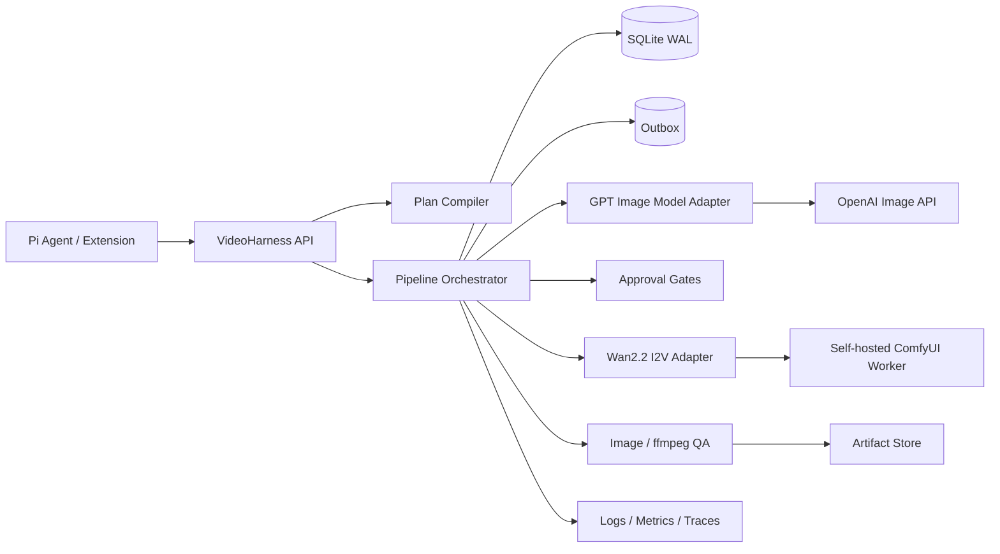

# GPT-Image-2 → Wan2.2-I2V-A14B 开发规格

- 文档状态：已确认；Phase A 离线实现已完成，Phase B–D 真实部分待实现
- 最后更新：2026-08-26
- 关联决策：[ADR-0001](../adr/0001-gpt-image-2-wan22-i2v-a14b-pipeline.md)
- Pipeline Profile：`gpt-image2-wan22-i2v-a14b-v1`
- 目标读者：实现 VideoHarness 服务、Pi Extension、模型适配器和测试的开发者

> 本文档仍定义 v0.1 的完整目标契约。未特别标注“Phase
> A 已实现”的 GPT-Image-2、ComfyUI/A14B、真实 MP4、ffmpeg QA 和正式 Pi
> SDK 集成均为待办，不应从目标契约推断为当前能力。实时边界见
> [实现状态](implementation-status.md)。

## 1. 目标

实现一条可恢复、可确认、可追踪的首帧驱动视频生成流水线：

1. 将用户创意编译为结构化的 Shot Plan；
2. 使用固定版本的 GPT-Image-2 生成首帧候选；
3. 在人工选择后，把首帧标准化为 Wan 输入资产；
4. 使用自托管的 `Wan2.2-I2V-A14B` 生成预览与成片；
5. 对每个阶段执行质量检查，保存完整 Artifact lineage；
6. 在进程重启、网络中断或 Worker 重连后安全恢复；
7. 不静默切换模型，不因模糊重试而重复计费或重复占用 GPU。

### 1.1 首版成功标准

以下是 Phase B–D 完成后的真实模型成功标准。Phase A 已用确定性 Fake
Backends 验证同样的四 Gate 编排、持久化、幂等和恢复，但 Fake
video 是测试 JSON，不是可播放 MP4。

- 用户可以从一个创意 Brief 创建不产生费用的计划。
- 用户确认计划后，系统生成 2 张 GPT-Image-2 首帧候选。
- 用户可以选择、请求修改或重新生成首帧。
- 选定首帧通过技术 QA 后，系统生成 2 个 A14B 480P 预览。
- 用户选择动作方向后，系统生成 A14B 720P 成片。
- 最终返回 H.264 MP4、poster、所有中间图片、QA 报告和 manifest。
- 任意视频都能反向追踪到首帧、Prompt 版本、模型版本、Workflow 和人工决定。
- 服务重启不会丢失 Gate、重复调用 OpenAI 或重复提交 ComfyUI 任务。

## 2. 非目标

首版不包含：

- 文生视频；
- 多镜头自动剪辑、配乐、TTS 或字幕；
- 1:1 画幅的正式承诺；
- 百炼 `wan2.2-i2v-plus`、Seedance、Kling 或其他托管视频 API；
- 自动训练、LoRA、GGUF、第三方 Wan Wrapper 或 4-step 加速；
- 无人值守地自动接受图片或成片；
- 跨不同硬件或驱动的字节级确定性；
- 把用户素材或生成图长期保存在第三方 URL。

## 3. 固定决策与默认值

| 项目             | 默认值                                           |
| ---------------- | ------------------------------------------------ |
| 图片 API         | OpenAI Image API                                 |
| 图片模型         | `gpt-image-2-2026-04-21`                         |
| 图片候选         | 2 张，允许配置为 1–4 张                          |
| 图片质量         | `medium`；显式精修时可用 `high`                  |
| 图片格式         | PNG、opaque、sRGB、8-bit RGB                     |
| 横屏尺寸         | `1280x720`                                       |
| 竖屏尺寸         | `720x1280`                                       |
| 视频模型         | `wan22-i2v-a14b`                                 |
| 视频运行时       | 自托管 ComfyUI                                   |
| 预览             | A14B、480P 面积档、2 个 seed                     |
| 成片             | A14B、720P 面积档、81 帧、16 fps、约 5 秒        |
| 默认画幅         | 16:9                                             |
| 首版画幅         | 16:9、9:16                                       |
| Prompt Extension | 默认关闭                                         |
| A14B Worker 并发 | 每个 Worker 1 个生成任务                         |
| 自动视频重试     | 仅能证明尚未提交的瞬时错误；自动质量 reroll 关闭 |

v0.1 的外部请求将 `durationSeconds` 限制为字面量
`5`；它是产品档位名称，实际媒体时长由 81 帧和 16
fps 决定（约 5.06 秒），验收以 manifest 中的帧数、fps 和实测 duration 为准。

GPT-Image-2 允许任意满足边长、面积和宽高比限制的输出尺寸，因此上述横竖屏尺寸直接由图片模型生成，不执行隐藏裁切。OpenAI
Image API 返回 base64 图像数据，服务必须立即导入受控 Artifact Store。

Wan 官方开源 A14B 默认配置为 81 帧、16
fps；480P 与 720P 使用不同面积档，I2V 实际画幅跟随输入图像。百炼
`wan2.2-i2v-plus` 的固定 5 秒、30 fps、480P/1080P 契约不适用于本规格。

## 4. 总体架构



### 4.1 模块职责

| 模块                            | Phase A 状态     | 职责/边界                                                                        |
| ------------------------------- | ---------------- | -------------------------------------------------------------------------------- |
| `contracts`                     | 已实现           | 请求、计划、Pipeline、Stage、Gate、Artifact、Backend 与错误 schema               |
| `core`                          | 已实现离线核心   | SQLite WAL、事务、幂等、Outbox、状态机、lineage 与恢复                           |
| `pipeline`                      | 已实现 Fake 编排 | 四 Gate、StageRun、reroll、cancel、supersede、Profile/计划哈希                   |
| `backend-fake`                  | 已实现           | 确定性图片和测试专用非 MP4 视频 payload，无网络                                  |
| `backend-openai-image`          | 禁用占位         | 校验固定快照命令并返回 `backend_unavailable`；无 SDK/网络调用                    |
| `backend-comfyui`               | 禁用占位         | 保留 A14B/禁止回退契约；无 HTTP/WebSocket                                        |
| `media`                         | 部分实现         | 安全原子 Artifact Store、哈希和文件头检查；深度解码/ffmpeg 返回 `not_configured` |
| `video-harness`                 | 已实现兼容边界   | HTTP Client 和三个 Pi-compatible 工具；正式 Pi SDK 注册/卡片/发布未完成          |
| `model-gpt-image` / `model-wan` | 未实现           | Phase B/C 的真实参数策略、Workflow 编译和产物收集                                |

## 5. 端到端 Pipeline

### 5.1 Stage 顺序

| 顺序 | Stage               | 输入                   | 输出                   | 默认 Gate                                 |
| ---- | ------------------- | ---------------------- | ---------------------- | ----------------------------------------- |
| 0    | `plan_compile`      | 用户 Brief             | `ImageToVideoPlan`     | draft Pipeline 创建后打开 `plan_approval` |
| 1    | `image_preview`     | 已批准 Plan            | 2 个图片候选           | —                                         |
| 2    | `image_validate`    | 图片候选               | QA 报告与排序          | `image_selection`                         |
| 3    | `image_final`       | 选中图片、可选修改意见 | 最终首帧               | 可选 `image_final_approval`               |
| 4    | `frame_normalize`   | 最终首帧               | `wan_input_frame`      | —                                         |
| 5    | `video_preview`     | 输入帧与 Motion Prompt | 2 个 480P 视频         | —                                         |
| 6    | `video_validate`    | 视频候选               | QA 报告与排序          | `video_selection`                         |
| 7    | `video_final`       | 选中 seed/方向         | 720P 成片              | —                                         |
| 8    | `video_postprocess` | 原始视频               | MP4、poster、thumbnail | `final_acceptance`                        |

`image_final` 不是每次必需。如果用户直接接受 `medium`
候选，该候选可以原样晋级；如果用户要求局部修改或身份精修，则通过 `images.edit`
创建新 Artifact，不能覆盖原候选。

### 5.2 预览与成片关系

- 预览和成片必须使用同一 `wan22-i2v-a14b` 模型适配器。
- 预览使用 480P 面积档；成片使用 720P 面积档。
- 成片默认复用被选预览的 seed、Prompt 版本和输入帧。
- 分辨率变化可能导致动作差异，系统不得把预览描述为逐帧保证。
- 如果最终视频不合格，系统保留首帧和 Prompt，仅创建新的 video
  `StageRun`；不得自动重做首帧。

## 6. Prompt 契约

### 6.1 ShotSpec

```ts
interface ShotSpec {
  subject: string;
  identityConstraints?: string[];
  wardrobe?: string;
  environment: string;
  composition: string;
  shotSize: "close_up" | "medium" | "full" | "wide";
  cameraAngle?: string;
  lens?: string;
  lighting?: string;
  colorPalette?: string;
  style?: string;
  initialPose: string;
  subjectMotion: string;
  secondaryMotion?: string;
  cameraMotion?: string;
  continuityConstraints?: string[];
  forbiddenElements?: string[];
}
```

### 6.2 stillPrompt

`stillPrompt` 只能描述首帧可观察内容：

- 主体身份、服装与起始姿态；
- 场景、构图、景别、镜头、光照与色彩；
- 动作发生方向的留白；
- 单帧画面禁止项，例如运动模糊、字幕、水印和重复人物。

GPT-Image-2 不使用独立 `negative_prompt` 参数，禁止项需要以明确的正向约束写入
`stillPrompt`。

### 6.3 motionPrompt

`motionPrompt` 只描述 5 秒内的动态：

- 一个主要主体动作；
- 最多一个次级环境运动；
- 最多一种镜头运动；
- 速度、方向、节奏和连续性；
- 身份、服装和背景几何保持约束。

默认使用英文且建议不超过 80 词。运行时不得再次自动扩写。

### 6.4 negativePrompt

保留 Wan 官方 `wan/configs/shared_config.py` 中的
`sample_neg_prompt`，并按固定顺序合并：

1. 冻结的 Wan 官方默认值；
2. 下列项目约束；
3. 用户额外约束（如有）。

官方默认值的上游来源为
[`Wan-Video/Wan2.2@42bf4cf`](https://github.com/Wan-Video/Wan2.2/blob/42bf4cfaa384bc21833865abc2f9e6c0e67233dc/wan/configs/shared_config.py)；代码中使用冻结副本，不能在运行时跟随
`main` 漂移。变更该副本必须同时创建新 Profile 版本并冻结新的 runtime manifest。

```text
identity drift, facial deformation, extra limbs or fingers,
duplicated objects, melting, warping, flicker, camera shake,
sudden cuts, background drift, text or logo distortion
```

不得整体替换官方默认值。顶层 Prompt 的来源始终记为 `compiler`；`components` 按
`official_default`、`project_constraints`、可选 `user_append`
分别记录文本、来源 ID、适用时的来源版本和 SHA-256。schema 直接约束组件顺序并拒绝替换、重复或乱序。最终合并文本、合并策略、组件溯源和总 SHA-256 先写入 Plan，manifest 再完整包含获批 Plan。

## 7. 图像交接契约

### 7.1 FrameSpec

```ts
type SupportedAspectRatio = "16:9" | "9:16";

interface CommonFrameSpec {
  mimeType: "image/png";
  colorSpace: "srgb";
  bitDepth: 8;
  channels: 3;
  alpha: false;
  cropPolicy: "none";
}

type FrameSpec = CommonFrameSpec &
  (
    | { aspectRatio: "16:9"; width: 1280; height: 720 }
    | { aspectRatio: "9:16"; width: 720; height: 1280 }
  );
```

### 7.2 标准化步骤

顺序必须固定：

1. base64 解码并验证真实文件类型；
2. 应用 EXIF orientation；
3. 将 ICC profile 转换为 sRGB；
4. 如有 alpha，按批准底色合成并移除；
5. 转换为 8-bit、3 通道 RGB；
6. 校验或显式 resize 到 FrameSpec；
7. 写入无损 PNG；
8. 计算 SHA-256；
9. 登记 `normalized_from` lineage。

技术修复在本地执行，不为方向、ICC、alpha 或编码问题重新调用 GPT-Image-2。

### 7.3 动画友好性

- 主体默认 1 个，最多 2 个独立运动主体；
- 画面四周至少保留约 5% 安全区域；
- 朝运动方向至少保留约 20% 空间；
- 全身镜头必须完整显示手脚，避免肢体互相遮挡；
- 起始姿态应自然稳定，不使用高速动作中间态；
- 避免复杂手部交互、密集人群、镜面重复、强反射和细密重复纹理。

## 8. 领域模型

### 8.1 Plan 与运行记录

```ts
interface ImageToVideoPlan {
  planId: string;
  planVersion: number;
  pipelineProfileId: "gpt-image2-wan22-i2v-a14b-v1";
  pipelineProfileHash: string;
  originalBrief: string;
  shot: ShotSpec;
  frame: FrameSpec;
  stillPrompt: VersionedPrompt;
  motionPrompt: VersionedPrompt;
  negativePrompt: VersionedPrompt;
  imageStage: ImageStageSpec;
  videoStage: VideoStageSpec;
  candidatePolicy: CandidatePolicy;
  approvalPolicy: ApprovalPolicy;
  estimate: PipelineEstimate;
  planHash: string;
  createdAt: string;
}

interface PipelineRun {
  pipelineId: string;
  planId: string;
  planVersion: number;
  planHash: string;
  approvedPlanVersion?: number;
  approvedPlanHash?: string;
  status: PipelineStatus;
  version: number;
  activeStageId?: string;
  createdAt: string;
  updatedAt: string;
}

interface PipelineStage {
  stageId: string;
  pipelineId: string;
  kind: StageKind;
  status: LogicalStageStatus;
  semanticRequestHash: string;
  inputArtifactIds: string[];
  runIds: string[];
  activeRunId?: string;
  currentOutputArtifactIds: string[];
  createdAt: string;
  updatedAt: string;
}

interface StageRun {
  runId: string;
  stageId: string;
  pipelineId: string;
  attemptNumber: number;
  status: StageRunStatus;
  commandHash: string;
  backendRef?: BackendJobRef;
  inputArtifactIds: string[];
  outputArtifactIds: string[];
  createdAt: string;
  updatedAt: string;
}

interface ApprovalGate {
  gateId: string;
  pipelineId: string;
  kind: GateKind;
  status: GateStatus;
  candidateArtifactIds: string[];
  selectedArtifactId?: string;
  decision?: "select" | "approve" | "reject" | "request_changes";
  expectedPipelineVersion: number;
  comment?: string;
  decidedAt?: string;
}
```

### 8.2 Prompt 版本

```ts
interface VersionedPrompt {
  promptId: string;
  kind: "still" | "motion" | "negative";
  version: number;
  text: string;
  source: "user" | "compiler" | "user_edit";
  parentPromptId?: string;
  sha256: string;
}
```

任何 Prompt 变化都创建新版本。修改 `stillPrompt`
会 supersede 图片和全部下游视频；修改 `motionPrompt` 只 supersede 视频阶段。

## 9. Model Adapter 与 Backend Driver

现有 `VideoBackend.submit(graph: ComfyPromptGraph)`
把通用后端接口绑定到 ComfyUI。实现前应改为类型化 Command：

```ts
interface BackendCommand {
  kind: string;
}

interface ModelAdapter<I, R, C extends BackendCommand> {
  capabilities(): ModelCapabilities;
  normalize(input: I, environment: EnvironmentSnapshot): R;
  estimate(input: R): ResourceEstimate;
  compile(input: R): C;
  collect(result: BackendResult): ArtifactDescriptor[];
}

interface BackendDriver<C extends BackendCommand> {
  health(): Promise<BackendHealth>;
  start(command: C, context: RunContext): Promise<StartResult>;
  get?(ref: BackendJobRef): Promise<BackendJob>;
  watch?(ref: BackendJobRef, signal: AbortSignal): AsyncIterable<StageEvent>;
  cancel?(ref: BackendJobRef): Promise<CancelResult>;
  reconcile(run: StageRunRecord): Promise<ReconcileResult>;
}

type StartResult =
  | { kind: "submitted"; ref: BackendJobRef }
  | { kind: "completed"; result: BackendResult };
```

### 9.1 OpenAIImageCommand

```ts
interface OpenAIImageCommand extends BackendCommand {
  kind: "openai.image.generate" | "openai.image.edit";
  model: "gpt-image-2-2026-04-21";
  prompt: string;
  referenceArtifactIds: string[];
  size: "1280x720" | "720x1280";
  quality: "medium" | "high";
  outputFormat: "png";
  background: "opaque";
  candidateCount: number;
}
```

生成用 `images.generate`；人物连续镜头或局部精修用
`images.edit`。GPT-Image-2 对图像输入自动使用高保真处理，不传 `input_fidelity`。

### 9.2 ComfyPromptCommand

```ts
interface ComfyPromptCommand extends BackendCommand {
  kind: "comfy.prompt";
  workflowId: string;
  workflowVersion: string;
  workflowHash: string;
  graph: ComfyPromptGraph;
  outputPrefix: string;
}
```

`Wan22I2VA14BAdapter` 只允许 patch
manifest 声明的字段：输入图片、正负 Prompt、seed、面积档、length、steps、shift 与允许的采样参数。调用方不能上传任意节点图。

## 10. HTTP API 与 Pi 工具

### 10.1 HTTP API

| 方法与路径                                               | 用途                                                                   |
| -------------------------------------------------------- | ---------------------------------------------------------------------- |
| `GET /v1/health`                                         | 服务、数据库、OpenAI 配置和 ComfyUI 健康检查                           |
| `GET /v1/capabilities`                                   | 返回图片/视频模型、规格、Worker 与限制                                 |
| `POST /v1/assets`                                        | 上传并校验参考图或输入素材（Phase A 未实现）                           |
| `POST /v1/plans`                                         | 创建并持久化不产生费用的 Plan                                          |
| `GET /v1/plans/:planId`                                  | 读取 Plan、版本和估算                                                  |
| `POST /v1/pipelines`                                     | 按指定 Plan 创建 draft Pipeline 并打开 `plan_approval`；不调用外部生成 |
| `GET /v1/pipelines/:pipelineId`                          | 获取 Pipeline、活动 Stage 与 Gate                                      |
| `GET /v1/pipelines/:pipelineId/events`                   | Phase A 已实现有界长轮询；SSE 待办                                     |
| `POST /v1/pipelines/:pipelineId/gates/:gateId/decisions` | 选择、批准、拒绝或请求修改                                             |
| `POST /v1/pipelines/:pipelineId/cancel`                  | 取消 Pipeline 与可取消的活动 Stage                                     |
| `POST /v1/pipelines/:pipelineId/rerolls`                 | 创建显式的新候选运行                                                   |
| `GET /v1/pipelines/:pipelineId/artifacts`                | 获取所有产物与 lineage                                                 |

计划中的 `POST /v1/jobs` 作为叶子 Stage 的内部执行接口，目前未实现。表中除
`/v1/assets` 外的 Pipeline API 已在 Phase A 可用，其执行后端仅为 Fake；
`POST /v1/pipelines` 只创建 draft 和计划 Gate，不调用 Backend。

Gate 决策请求：

```ts
interface GateDecisionInput {
  action: "select" | "approve" | "reject" | "request_changes";
  selectedArtifactId?: string;
  comment?: string;
  expectedPipelineVersion: number;
  idempotencyKey: string;
}
```

版本不匹配返回 `409 pipeline_version_conflict`，不能让旧任务卡片覆盖新选择。

### 10.2 Pi 工具映射

Phase A 已实现下列 HTTP Client 映射和工具定义，但尚未使用正式 Pi
SDK 完成注册、审批卡片或 Package 发布。

- `video_generate({ dryRun: true, ... })`：创建 Plan 并显示 Prompt、模型、候选数量和估算；
- `video_generate({ planId, expectedPlanHash, ... })`：创建 draft
  Pipeline 和计划 Gate，不执行付费调用；
- `video_job({ action: "status" | "wait" | "cancel" | "result" })`：提供计划中的查询、等待、取消和结果行为；
- `video_job({ action: "select" | "approve" | "request_changes" | "reroll" })`：处理 Gate；只有计划 Gate 批准后，Pipeline 才进入图片生成；
- `video_capabilities`：返回 GPT-Image-2、A14B、支持画幅、默认规格、Worker 状态和费用保护状态。

## 11. 状态机

以下联合类型是 contracts 的唯一枚举来源；README 只保留其摘要：

```ts
type PipelineStatus =
  | "draft"
  | "awaiting_approval"
  | "queued"
  | "running"
  | "reconciling"
  | "needs_attention"
  | "cancelling"
  | "cancelled"
  | "failed"
  | "completed";

type StageRunStatus =
  | "pending"
  | "queued"
  | "preflight"
  | "submitting"
  | "submitted"
  | "running"
  | "reconciling"
  | "postprocessing"
  | "validating"
  | "completed"
  | "outcome_unknown"
  | "cancelling"
  | "cancelled"
  | "failed";

type LogicalStageStatus =
  | "pending"
  | "active"
  | "completed"
  | "failed"
  | "cancelled"
  | "superseded";

type GateStatus = "open" | "decided" | "superseded";
```

### 11.1 Pipeline 状态

```text
draft
  -> awaiting_approval
  -> queued
  -> running
  -> awaiting_approval
  -> running
  -> completed

queued/running -> reconciling -> running 或 needs_attention
任意可取消非终态 -> cancelling -> cancelled
任意适用非终态可进入 needs_attention 或 failed。
```

Pipeline 的 `awaiting_approval` 必须关联一个活动
`ApprovalGate`，不能只靠状态字符串推断用户需要做什么。

### 11.2 Stage 状态

```text
pending -> queued -> preflight -> submitting -> submitted -> running
        -> postprocessing -> validating -> completed

submitting/submitted/running -> reconciling
任意非终态 -> cancelling -> cancelled
任意执行阶段 -> failed
无法确认远端结果 -> outcome_unknown
```

`StageRun` 是不可篡改的执行历史；其终态为 `completed`、`failed`、`cancelled` 或
`outcome_unknown`。`superseded`
属于逻辑 Stage、候选和 Gate 的当前性：上游发生变化时保留旧 Run 的真实结果，但禁止它继续晋级。

### 11.3 恢复规则

- 状态和 Outbox 事件必须先持久化，再调用外部服务。
- Backend 返回后先持久化完整结果 checkpoint，再导入本地 Artifact；有 checkpoint 的恢复不得重新提交，也不得依赖远端任务仍可查询。
- 所有持久化 Backend Driver 都必须实现
  `reconcile`。没有 checkpoint 的旧尝试若无法权威确认结果，必须进入
  `outcome_unknown`；`not_found`、缺少远端 ID 或 Adapter 缺少对账能力都不是重新提交的授权。
- BackendResult 必须在导入前校验输出数量/种类、模型、尺寸、Prompt
  lineage 和 Pipeline/Stage/Run 关联；载荷缺失、哈希不符等确定性批量导入失败时，已登记输出仅作为 superseded 审计历史存在，不能留在 Stage 当前输出或进入 Gate。
- checkpoint、文件写入或 SQLite 落库的瞬时失败属于本地 settlement
  failure，不得调用 Backend
  failure 路径、丢弃已付费结果或把 Outbox 标死。有 checkpoint 时回放；没有 checkpoint 但请求可能已被受理时先对账。Run
  `completed`、Backend Outbox `completed` 与 `stage.run_completed`
  事件必须在同一个数据库事务中提交。
- `submitted`/`running` ComfyUI Stage 在恢复时查询 queue/history。
- 已知 Comfy prompt ID 丢失时，通过唯一 output prefix 和 runId 对账。
- OpenAI 请求返回成功后，先导入图片和 usage，再把 Stage 标记为 completed。
- OpenAI 请求已发出但结果未知时进入 `needs_attention`；不得无条件重新调用。
- 已持久化的取消意图优先于旧 Gate continuation 和尚未开始的 Backend
  intent；取消后迟到的 Backend/本地后处理产物只保留为 superseded 历史，不得重新打开 Gate。
- 人工 Gate 永不过期为失败；超时只影响当前客户端等待。

## 12. 幂等、重试与晋级

### 12.1 幂等键

```text
pipelineKey = clientIdempotencyKey + submittedPlanHash

logicalStageKey = pipelineId + stageKind + semanticInputHash

submissionKey = sha256(pipelineId + stageId + runId + commandHash)
```

- 相同顶层幂等键返回相同 `pipelineId`。
- draft Pipeline 创建时使用请求中的 `expectedPlanHash` 作为
  `submittedPlanHash`；计划 Gate 批准后，再把该值冻结为
  `approvedPlanHash`，所有付费 Stage 必须引用已冻结的 hash。
- Stage 成功后，重复消费 Outbox 只能返回已登记产物。
- `image_preview` 的一次 OpenAI 命令包含
  `candidateCount`，默认一次返回 2 张图；图片的 response
  index 只属于 Artifact 元数据，不进入该次付费提交的幂等键。
- A14B 预览按 seed 创建独立且串行的 `StageRun`；seed 已包含在各自的
  `commandHash` 中。
- GPT-Image-2 没有 seed 作为复现保证，因此幂等必须复用已保存结果，不能再次调用模型。

### 12.2 术语

- `retry`：同一语义请求的新 `StageRun`；Prompt、输入和参数不变。
- `reroll`：创建新候选，必须产生新
  `StageRun`；视频使用新 seed，图片创建新的 candidate batch 并记录
  `rerollOrdinal`，批次内索引只标识返回 Artifact。
- `promote`：从选中的 preview 创建 quality Stage。
- `request_changes`：产生新 Prompt 或图片版本，并 supersede 受影响的下游 Stage。

### 12.3 自动重试

- 参数、鉴权、审核、缺模型、Workflow 不兼容和 OOM 不自动重试。
- OpenAI SDK 自带重试必须关闭，所有重试只由 Orchestrator 单点控制。
- 只有明确的
  `429`、请求尚未发送就失败，或供应商明确表示“未受理”的响应，才能使用指数退避和 jitter 自动重试；默认最多 1 次。
- 请求体可能已经发送后的断线、超时或无法证明未受理的 `5xx` 进入
  `reconciling`；如果没有可查询的远端 ID，则 Pipeline 进入
  `needs_attention`，不得自动重发。
- ComfyUI 临时传输错误可自动重连一次，并先执行 history 对账。
- 自动质量 reroll 关闭；质量失败进入人工处理，只有用户显式操作才能创建新的 reroll
  `StageRun`。
- 不得切换为 5B、百炼 Plus、Flash 或其他模型。

## 13. Artifact lineage

### 13.1 目录

```text
data/pipelines/<pipelineId>/
├── pipeline-plan.json
├── pipeline-manifest.json
├── events.jsonl
├── prompts/
│   ├── still-prompt-v1.txt
│   ├── motion-prompt-v1.txt
│   └── negative-prompt-v1.txt
├── images/
│   ├── candidate-01.png
│   ├── candidate-02.png
│   ├── selected.png
│   └── wan-input-frame.png
└── videos/
    ├── preview-01.mp4
    ├── preview-02.mp4
    ├── final.mp4
    ├── poster.jpg
    └── thumbnail.jpg

data/runs/<runId>/
├── request.json
├── resolved-request.json
├── backend-command.json
├── events.jsonl
├── qa-report.json
└── manifest.json
```

### 13.2 Artifact 元数据

```ts
interface ArtifactDescriptor {
  artifactId: string;
  pipelineId: string;
  stageId: string;
  runId: string;
  kind: ArtifactKind;
  mimeType: string;
  sha256: string;
  sizeBytes: number;
  width?: number;
  height?: number;
  durationSeconds?: number;
  frameRate?: number;
  frameCount?: number;
  storagePath: string;
  modelId?: string;
  modelRevision?: string;
  backendRequestId?: string;
  promptIds: string[];
  qaReportArtifactId?: string;
}

interface ArtifactRelation {
  parentArtifactId: string;
  childArtifactId: string;
  relation:
    | "generated_from"
    | "selected_from"
    | "refined_from"
    | "normalized_from"
    | "promoted_from"
    | "derived_from";
}
```

### 13.3 Manifest 必填内容

- 原始 Brief 与所有 Prompt 版本；
- GPT-Image-2 snapshot、请求 ID、reference hash、usage 和费用；
- A14B 模型 ID、checkpoint revision、精度、文件 SHA-256；
- ComfyUI、CUDA、PyTorch、Workflow 版本与哈希；
- seed、分辨率面积档、length、fps、steps、shift、CFG 与 solver；
- 输入和输出 Artifact 哈希；
- QA 报告、人工 Gate 决策、时间戳和决定版本；
- 每个 Stage 的耗时、重试、GPU 峰值和最终状态。

## 14. 质量门禁

### 14.1 图片硬门禁

以下条件必须全部满足：

- 文件可解码且真实 MIME 为 PNG；
- 尺寸与 FrameSpec 完全一致；
- sRGB、8-bit、3 通道 RGB、无 alpha；
- 无未应用的 EXIF 方向；
- 无黑边、白边或截断文件；
- SHA-256 与登记值一致；
- 没有非预期 OCR 文本或水印。

内容评分只用于排序和提示：

- Brief/画面一致性；
- 人物身份一致性；
- 人体和物体结构；
- 构图和运动空间；
- 清晰度、曝光和色彩。

所有候选仍需人工选择。角色 embedding 阈值必须在 Golden
Set 上校准后才能成为硬门禁。

### 14.2 视频硬门禁

- ffprobe 可以完整解析和解码；
- 分辨率、fps、duration 和 frame count 符合 Workflow manifest；
- 容器为标准 H.264 MP4，像素格式可被目标播放器解码；
- 不存在长黑帧、空输出或全程冻结；
- 第 0 帧与 `wan_input_frame` 的相似度低于校准阈值时进入 `needs_attention`；
- 没有非预期跳切、严重闪烁或大面积背景漂移。

语义排序可以检查主体数量、身份、服装、动作方向和运镜，但不能自动接受最终成片。

## 15. 错误模型

以下列表是 v0.1 contracts 的统一错误码来源；README 只保留同一列表的摘要：

| 错误码                       | 自动重试        | 含义                            |
| ---------------------------- | --------------- | ------------------------------- |
| `invalid_request`            | 否              | Brief、Prompt 或参数不合法      |
| `not_found`                  | 否              | 请求的领域资源不存在            |
| `plan_version_conflict`      | 否              | 使用了过期 Plan                 |
| `pipeline_version_conflict`  | 否              | Gate 决策来自过期界面           |
| `approval_required`          | 否              | Pipeline 正等待人工决定         |
| `image_generation_blocked`   | 否              | OpenAI 输入或输出审核拒绝       |
| `image_generation_ambiguous` | 否，先对账      | 请求结果未知，可能已计费        |
| `image_normalization_failed` | 视原因          | 图片无法满足 FrameSpec          |
| `image_quality_gate_failed`  | 否              | 首帧未通过硬门禁                |
| `missing_asset`              | 否              | 参考图或输入帧不存在/校验失败   |
| `model_identity_mismatch`    | 否              | Worker 模型文件与 manifest 不符 |
| `workflow_incompatible`      | 否              | 节点或 Workflow 版本不匹配      |
| `insufficient_memory`        | 否              | 预检发现资源不足                |
| `backend_unavailable`        | 有限            | OpenAI 或 ComfyUI 暂时不可用    |
| `backend_timeout`            | 有限，先对账    | 后端在约定时间内无确定响应      |
| `backend_oom`                | 否              | A14B 执行时 OOM                 |
| `decode_failed`              | 有限            | 输出无法正常解码                |
| `artifact_superseded`        | 否              | 产物已被新上游版本淘汰          |
| `video_quality_gate_failed`  | 否；显式 reroll | 视频未通过质量门禁              |
| `cancelled`                  | 否              | 用户或系统明确取消              |

错误响应不得包含 API Key、完整隐私 Prompt、base64 图片或非必要的本地绝对路径。

## 16. 配置

环境变量只承载秘密和部署差异；应与 README 使用同一组名称：

```dotenv
VIDEOHARNESS_HOST=127.0.0.1
VIDEOHARNESS_PORT=8787
VIDEOHARNESS_DATA_DIR=./data
VIDEOHARNESS_AUTH_TOKEN=replace-with-a-secret

OPENAI_API_KEY=replace-with-a-secret
VIDEOHARNESS_ENABLE_CLOUD_IMAGE=false
VIDEOHARNESS_OPENAI_TIMEOUT_MS=180000
VIDEOHARNESS_OPENAI_MAX_AUTO_RETRIES=1

COMFYUI_BASE_URL=http://127.0.0.1:8188
COMFYUI_WS_URL=ws://127.0.0.1:8188/ws

VIDEOHARNESS_PIPELINE_PROFILES=gpt-image2-wan22-i2v-a14b-v1
VIDEOHARNESS_PROMPT_LOG_MODE=hash
VIDEOHARNESS_ARTIFACT_RETENTION_DAYS=30
VIDEOHARNESS_MAX_CONCURRENT_GENERATIONS=1
VIDEOHARNESS_MIN_FREE_DISK_GIB=100
VIDEOHARNESS_MEMORY_RESERVE_GIB=20
```

模型和生成参数进入版本控制的
`config/pipelines/gpt-image2-wan22-i2v-a14b.v1.json`，并以内容哈希参与
`planHash`。Gate 要求也只由该 Profile 定义；环境变量或部署开关只能禁止执行，不能放宽 Gate：

```json
{
  "schemaVersion": "1",
  "profileId": "gpt-image2-wan22-i2v-a14b-v1",
  "image": {
    "model": "gpt-image-2-2026-04-21",
    "quality": "medium",
    "candidateCount": 2,
    "maxCandidateCount": 4,
    "sizeByAspectRatio": {
      "16:9": "1280x720",
      "9:16": "720x1280"
    },
    "format": "png",
    "background": "opaque"
  },
  "video": {
    "adapterId": "wan22-i2v-a14b",
    "allowFallback": false,
    "runtimeManifest": {
      "precisionProfile": "to-be-frozen-in-phase-c",
      "checkpointManifestHash": "to-be-frozen-in-phase-c",
      "previewWorkflowHash": "to-be-frozen-in-phase-c",
      "finalWorkflowHash": "to-be-frozen-in-phase-c"
    },
    "preview": {
      "sizeByAspectRatio": {
        "16:9": "832x480",
        "9:16": "480x832"
      },
      "frames": 81,
      "fps": 16,
      "steps": 40,
      "shift": 5.0,
      "cfgHigh": 3.5,
      "cfgLow": 3.5,
      "seedCount": 2
    },
    "final": {
      "sizeByAspectRatio": {
        "16:9": "1280x720",
        "9:16": "720x1280"
      },
      "frames": 81,
      "fps": 16,
      "steps": 40,
      "shift": 5.0,
      "cfgHigh": 3.5,
      "cfgLow": 3.5,
      "seedStrategy": "reuse-selected-preview"
    }
  },
  "gates": {
    "plan": true,
    "image": true,
    "preview": true,
    "final": true
  }
}
```

该 Profile ID 在 Phase
C 冻结 checkpoint、精度配置、Workflow 和哈希前只属于保留 ID，包含
`to-be-frozen-in-phase-c`
的 Profile 不能以生产模式启动。Preview/Final 的 steps、shift 和 CFG 在真实 Worker
smoke
test 后才可冻结；测试前它们是候选基线，不是已验证性能承诺。每个 Plan 必须保存实际
`pipelineProfileId` 与
`pipelineProfileHash`。真实密钥不得写入 Git、日志、事件、manifest 或测试 fixture。生产加载器必须拒绝浮动图片模型别名、未知 checkpoint 或 Profile/Workflow 哈希不匹配。

## 17. 安全与隐私

- OpenAI API Key 只存在于服务端秘密管理或环境变量中。
- Pi Extension 不直接持有供应商密钥。
- 用户图片与 reference 只从受控 Asset Store 读取，不接受任意远程 URL。
- 上传素材校验 MIME、真实解码格式、大小、像素数、路径与符号链接。
- 发送到 OpenAI 的 reference asset 必须记录用途和 consent metadata。
- 日志只记录 Artifact ID、哈希前缀、Prompt
  ID 和请求 ID，不记录 base64 或完整隐私内容。
- ComfyUI 仍默认监听
  `127.0.0.1`；远程云 Worker 通过私网、隧道或经过鉴权的 VideoHarness
  Worker 通道访问。
- Workflow 和模型文件使用 allowlist、revision 与 SHA-256 校验。
- 所有生成输出进入内容安全和来源标记 Policy Hook 的预留接口。

## 18. 可观测性与费用保护

### 18.1 关联 ID

所有事件至少携带：

- `requestId`
- `planId`
- `pipelineId`
- `stageId`
- `runId`
- `backendRequestId`

`backendRequestId` 是统一关联字段：OpenAI Stage 保存响应中的 request ID，ComfyUI
Stage 保存 prompt ID；原始字段名可以保留在已脱敏 Backend metadata 中。

### 18.2 指标

- Pipeline 与各 Stage 的排队、执行和人工等待时间；
- GPT-Image-2 请求数、候选数、Token usage、估算/实际费用与审核失败数；
- OpenAI 限流、超时、不确定结果和重试次数；
- A14B 模型加载时间、采样时间、峰值显存/统一内存与 OOM 数；
- 图片和视频 QA 通过率、reroll 率与人工选择率；
- 首帧到视频的相似度分布；
- 每个成功成片的端到端费用与 GPU 时间。

### 18.3 保护措施

- Plan 在启动前展示图片候选数、视频候选数和费用估算；
- 支持按 Pipeline 和每日设置 OpenAI 费用上限；
- 达到上限时进入 `needs_attention`，不自动降级模型；
- OpenAI live smoke 使用独立开关和极低候选上限，不进入普通 CI。

## 19. 测试计划

Phase A 当前已通过离线单元/契约/E2E 测试，包括 SQLite WAL、幂等/Outbox、四 Gate
Fake 全流程、HTTP/Client、真实 Profile 拦截，以及 Gate commit、提交意图、Backend
result、Backend Outbox complete、本地 Artifact commit 和旧 lease 回收的 crash
recovery；测试也覆盖 Backend result
checkpoint 回放、无 checkpoint 时的 reconcile-first、reroll 固定 ordinal 和最终 Artifact
ancestry、取消与迟到写入竞争、旧 continuation 乱序回放、BackendResult 语义污染拦截、确定性批量导入半失败清理，以及 checkpoint/Run/Outbox/完成事件本地单次 EIO 后不重复提交的恢复。以下同时包含 Phase
B–E 的目标测试；其中 OpenAI、ComfyUI、ffmpeg 和真实 MP4 项目尚未执行。

### 19.1 Contracts 与单元测试

- Plan、FrameSpec、Prompt、Pipeline、Stage、Gate 与 Artifact schema；
- 16:9/9:16 尺寸交集和拒绝 1:1；
- Prompt 版本与 supersede 传播；
- model routing 不允许 A14B 回退到 Plus、Flash 或 5B；
- 幂等键、retry/reroll/promote 语义；
- Gate optimistic concurrency；
- OpenAI 与 ComfyUI 错误映射。

### 19.2 Fake Backend

- Fake GPT Backend 返回 1–4 个 base64 PNG；
- 覆盖成功、429、5xx、审核阻止、超时和模糊结果；
- Fake ComfyUI 覆盖进度、断线、history 恢复、取消和 prompt ID 丢失；
- 固定 Workflow snapshot，检测节点绑定变化；
- Fake Pipeline 完成计划、选图、预览选择和成片全链路。

### 19.3 Crash injection

在每个“数据库事务提交/外部调用”边界强制重启：

- 不重复生成 GPT 图片；
- 不重复提交 ComfyUI；
- Gate 和选择不丢失；
- superseded 产物不会晋级；
- Outbox 可以安全重复消费。

### 19.4 Live smoke

- OpenAI：手动运行，固定 snapshot、1 个候选、费用硬上限；
- ComfyUI：A14B 480P 与 720P 各至少一个标准测试；
- 横屏与竖屏各一个完整 E2E；
- Worker 重启、低磁盘、模型 checksum 错误和 OOM；
- 结果必须保留完整 manifest 和 lineage。

### 19.5 Golden quality set

建立 10–20 个固定 Brief 与批准首帧，覆盖：

- 单人近景、全身动作、产品镜头、动物、室内和室外；
- 轻微推镜、横移、固定镜头和轻微环境运动；
- 横屏与竖屏；
- 人脸、手部、文字、反射、霓虹和重复纹理等高风险场景。

Golden
Set 用于校准首帧保持度、身份相似度、闪烁阈值和人工选择率，不承诺像素级 golden
output。

## 20. 实施阶段

### Phase A：Contracts 与 Fake Pipeline（已完成）

- 建立 TypeScript workspace 与 schemas；
- 实现 Pipeline、Stage、Gate、Artifact 与 Outbox；
- 实现 Fake Image/Video Backend；
- 完成状态机、幂等、恢复和 crash injection 基础测试。

验收：已通过。不访问外部 API 或 GPU，即可完成完整选择型 Pipeline，并在进程崩溃边界后恢复。Fake
video 是测试 JSON，不是 MP4。

### Phase B：GPT-Image-2（未完成）

- 实现 `backend-openai-image` 与 `model-gpt-image`；
- 导入 base64、usage 和 provider request metadata；
- 实现标准化、图片 QA、人工选图与精修；
- 增加费用上限和 live smoke 开关。

验收：用户可以生成、选择并固定符合 FrameSpec 的首帧。

### Phase C：Wan2.2-I2V-A14B（未完成）

- 锁定官方 ComfyUI I2V Workflow；
- 生成 Workflow manifest、模型清单和 SHA-256；
- 实现 480P preview 与 720P quality 编译；
- 实现 WebSocket/queue/history 恢复、取消与模型预检。

验收：真实 Worker 可从批准首帧生成 2 个预览和 1 个成片，不使用其他模型。

### Phase D：真实质量闭环与 Pi UX（未完成）

- 实现图片/视频 QA、reroll 和 supersede；
- 实现 Pi 计划卡、候选图卡、视频选择卡和最终产物卡；
- 实现 manifest、lineage、指标和成本展示。

验收：用户可以在同一 Pi 会话完成所有 Gate，服务重启后继续。

### Phase E：硬件与发布加固（未完成）

- DGX Spark 或云 GPU 性能基线；
- Golden quality set；
- 安全、隐私、费用和故障演练；
- 固定依赖版本并生成发布清单。

验收：横竖屏真实 E2E、恢复测试和费用保护全部通过。

## 21. Definition of Done

只有同时满足以下条件，首版才可标记完成：

- ADR 与本规格保持一致且实现没有隐式模型回退；
- 全部普通 CI 使用 Fake Backend，不下载大型权重、不访问付费 API；
- OpenAI 和 A14B live smoke 由显式开关触发；
- Pipeline、Stage、Gate 和 lineage contract 测试通过；
- crash injection 证明不会重复付费调用或重复 GPU 提交；
- 480P/720P、16:9/9:16 的真实测试通过；
- manifest 可以验证 GPT snapshot、A14B checkpoint、Workflow、Prompt 和输入哈希；
- API Key、隐私素材和 base64 不出现在 Git 或日志中；
- 用户可以拒绝、修改、reroll、取消并在重启后继续；
- 最终 MP4 可解码，QA 报告和中间资产可审计。

## 22. 实现前待实测项

以下项目不改变总体架构，但必须在实现阶段测量并固化：

- 目标 ComfyUI 版本与官方 Workflow JSON 哈希；
- I2V 高/低噪声模型、UMT5 和 VAE 的文件名与 SHA-256；
- DGX Spark 与目标云 GPU 的加载时间、峰值内存和单片耗时；
- 480P 预览到 720P 成片的动作相关性；
- 图片身份和视频首帧相似度阈值；
- OpenAI 请求超时、费用上限和组织限流；
- 横屏与竖屏的实际输出尺寸、边缘留白和 ffmpeg 规范化策略。

## 23. 参考资料

- [ADR-0001](../adr/0001-gpt-image-2-wan22-i2v-a14b-pipeline.md)
- [OpenAI GPT-Image-2 模型页](https://developers.openai.com/api/docs/models/gpt-image-2)
- [OpenAI 图像生成指南](https://developers.openai.com/api/docs/guides/image-generation)
- [Wan2.2 官方仓库](https://github.com/Wan-Video/Wan2.2)
- [Wan2.2 I2V 官方代码](https://github.com/Wan-Video/Wan2.2/blob/main/wan/image2video.py)
- [ComfyUI 官方 Wan2.2 工作流](https://docs.comfy.org/tutorials/video/wan/wan2_2)
- [阿里云百炼视频模型目录](https://help.aliyun.com/zh/model-studio/video-generate-edit-model/)
