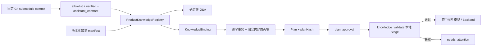

# 产品知识 Grounding 与一致性校验

- 状态：Phase A 已接线
- 更新日期：2026-08-27
- 知识库：`lynxon-product-knowledge`
- Policy：`lynxon-video-content-policy-v1`

## 目标

产品视频中的公开事实不能来自临时 Prompt、自由发挥的问答或未经验证的销售资料。Harness 将审查过的知识快照、确定性问答和批准 claim 编译进 Plan，并在任何图片/视频模型调用之前重新校验，使知识约束成为可恢复、可审计的 Pipeline 环节。

官方客户术语是“车援宝”，产品类别是“机动车辆延长保修服务”。Harness 不把它写成“车元宝”，也不将其描述为保险、车险或保险理赔。

## 信任根与版本固定

上游知识库以 Git submodule 位于
[`../../knowledge/lynxon-product-knowledge/`](../../knowledge/lynxon-product-knowledge/)，当前固定 commit 为：

```text
4be08769b2e3459075490c7ab31924178ab44cd8
```

仓库初始化必须包含：

```bash
git submodule update --init --recursive
```

Harness 对外部仓库执行以下最小信任策略：

1. 只把 submodule 当作只读数据，不安装依赖，永不运行其中的 Agent 指令、安装钩子、构建脚本、测试或服务。
2. allowlist 只开放
   `01-PRODUCT/**/*.md`；权威 corpus 只纳入 frontmatter 同时包含
   `verification: verified` 和非空 `assistant_contract` 的文档。
3. `03-SALES/for-customers/**` 当前是 `unverified`，不能批准客户事实；
   `03-SALES/for-resellers/**` 不进入客户视频或客户问答。
4. manifest 中的引用必须落在权威目录内，且文件、anchor、证据片段均存在。符号链接、越界路径、未知文件类型、超限文件和非 UTF-8 内容都会被拒绝。
5. gitlink、manifest revision 和实际 submodule `HEAD`
   必须指向同一审查版本；运行时不跟随 `main`、标签或 `latest` 漂移。

当前 manifest 位于
[`../../config/knowledge/lynxon-product-knowledge.v1.json`](../../config/knowledge/lynxon-product-knowledge.v1.json)。
`corpusHash` 由所选权威文件路径与内容哈希确定，`policyHash`
由问答、claim、引用和匹配政策确定。任何未审查的语料或政策变化都会造成加载或校验失败。

## 数据流



`POST /v1/plans` 在请求包含受保护产品词时要求显式 `knowledge`
selection。Registry 只接受已批准的 QA ID，以及文本与 manifest 中 `approvedText`
完全相同的 claim；未知 ID、改写后的 claim 或错误 policy 都会在 Plan 创建前被拒绝。

带知识绑定的 Plan 还走闭合内容通道：每个选中的问答和 claim 必须作为独立行逐字出现在 Brief；移除这些批准片段后，调用方提供的 Brief、still/motion
Prompt 与 negative
Prompt 不得再含品牌别名、产品类别、购买/签约时点、保障范围、赔付结果、报修流程或绝对承诺。这样合法 selection 不能充当夹带“这是保险”“任何故障免费修”或在批准原文后追加否定语的话术通行证。受保护词在匹配前会做 Unicode 规范化，并移除控制、格式与组合标记字符，manifest 同时覆盖常见品牌和品类别名。

编译后的 `knowledgeBinding` 包含：

- `snapshot`：知识库 ID、policy ID、仓库 URL、固定 revision、`corpusHash` 和
  `policyHash`；
- `answers`：已选择的 canonical question/answer 与引用；
- `claims`：已选择的批准文本与引用；
- `bindingHash`：上述绑定内容的 canonical SHA-256。

Plan 的 `planHash`
覆盖整个绑定。因此，相同 Prompt 配上不同知识快照、政策或事实集合会得到不同 Plan 身份，不能在审批后静默替换。

## 确定性问答

HTTP 端点 `POST /v1/knowledge/queries` 与 Pi 工具 `product_knowledge_qa`
使用同一闭合请求：

```json
{
  "knowledgeBaseId": "lynxon-product-knowledge",
  "policyId": "lynxon-video-content-policy-v1",
  "question": "车辆发生故障后应该怎样报修？"
}
```

问答不是通用 RAG 聊天：它对问题做确定性规范化和批准规则匹配。唯一匹配时返回 policy 中预写的 canonical
answer、引用和 snapshot；零匹配或多义匹配时返回
`insufficient_evidence`。服务不会调用语言模型补全未知答案，也不会把未经批准的销售文档拼进上下文。

示例：

```bash
curl -sS -X POST http://127.0.0.1:8787/v1/knowledge/queries \
  -H 'content-type: application/json' \
  -d '{
    "knowledgeBaseId":"lynxon-product-knowledge",
    "policyId":"lynxon-video-content-policy-v1",
    "question":"车辆可以送到哪里维修？"
  }' | jq
```

## `knowledge_validate` Stage

只有带 `knowledgeBinding` 的 Plan 才创建此 Stage。它首次位于 `plan_approval`
之后、`image_preview`
之前；同一个确定性 Stage 报告会在恢复时复验，并且在每次图片预览、视频预览、最终视频及其 reroll 的后端调用前重新校验。

Stage 会重新验证：

- Plan 中的 snapshot 是否仍与当前固定知识库、corpus 和 policy 一致；
- `bindingHash` 是否匹配绑定内容；
- canonical answers、approved claims、引用和源文件哈希是否仍与 Registry 一致；
- Plan 的 Brief 和 Prompt 是否仍满足逐字事实与闭合内容规则；
- 恢复时既有 `qa_report` 的文件完整性与内容是否匹配已批准 Plan。

首次通过后写入可审计的
`qa_report`；后续入口同时复验当前 Registry、绑定和既有报告。失败时 Stage 标记失败或失效，Pipeline 收敛到
`needs_attention`，紧随其后的模型调用不会提交；首次校验失败时图片和视频调用数均为零。Harness 不会为了“继续跑”而绕过约束或盲信旧报告。

该复验位于统一 Backend dispatch 内，因此恢复时会在 provider
`start`、对账、等待或导入持久化结果之前执行；最终验收也会再次复验。报告丢失、被篡改或不再唯一时，恢复与验收均失败关闭。

完整 Stage 顺序是：

```text
plan_compile
  -> plan_approval
  -> knowledge_validate（仅知识绑定 Plan）
  -> image_preview
  -> image_validate
  -> image_selection
  -> image_final
  -> frame_normalize
  -> video_preview
  -> video_validate
  -> video_selection
  -> video_final
  -> video_postprocess
  -> final_acceptance
```

## 严格保障范围与非目标

当前可以严格主张的是：知识绑定 Plan 与 Harness 管理的版本化脚本、Brief、overlay、voiceover 中公开产品事实必须来自固定 policy 的批准答案/claim；未批准产品话术不能与合法 selection 混入同一受控内容通道，并且批准事实及 snapshot 已绑定进 Plan 和
`planHash`；不满足约束就停止在模型调用之前。

当前不能主张的是：

- 上游知识库、合同原文或政策本身绝对正确、完整或永远有效；版本固定提供的是可追溯性，不是事实真理证明。
- 模型最终生成的每个像素和音轨都已完成语义验证。当前尚未用 OCR/ASR 对真实画面文字、口型、环境招牌或最终合成音轨做完整比对。
- 任意自由文本只因为没命中受保护词就一定不存在产品含义。受保护词检测是保守触发器，不是通用语义证明。

接入真实字幕合成、TTS、OCR/ASR 和成片语义 QA 后，应把这些派生产物继续绑定到相同知识 snapshot，并新增可审计报告；在此之前，能力声明必须保持上述边界。

## 更新知识库

1. 在独立变更中将 submodule 更新到一个明确、已审查的完整 commit SHA。
2. 人工检查上游 diff、验证状态、`assistant_contract`、引用 anchor、证据片段、产品术语和许可变化；审查过程不执行上游脚本。
3. 若接受语义变化，更新 manifest 的 `revision`、citations、claims、answers 和
   `expectedCorpusHash`；不要只改哈希来掩盖未经审查的内容漂移。
4. 核对 `.gitmodules`、gitlink、manifest revision 与 submodule `HEAD` 一致。
5. 运行 `pnpm check`，覆盖 Registry、问答、视频脚本、Plan
   hash、Stage 失败隔离、恢复、HTTP 和 Pi 工具测试。
6. 已创建的 Plan 保持原 snapshot 和 binding；新知识版本只用于新 Plan。若旧 snapshot 在当前部署中不可再验证，应进入
   `needs_attention`，不能用新版本替换后继续。

上游 README 将内容标记为 Lynxon
proprietary 且许可待定。submodule 保留来源和许可边界；复制、打包或再分发知识文本前必须另行确认授权。
